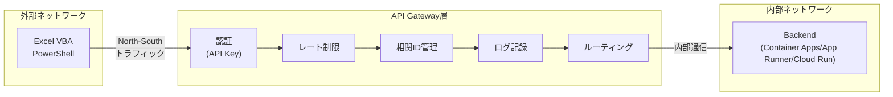
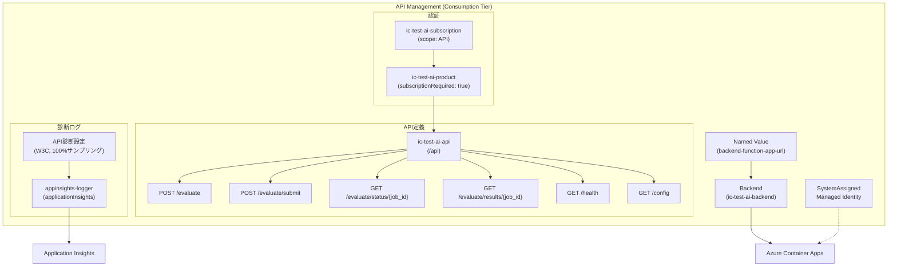
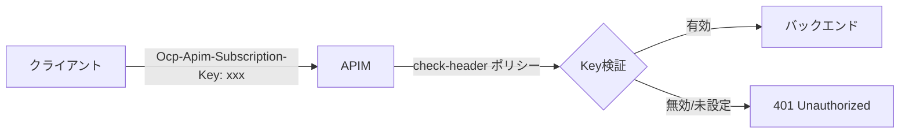
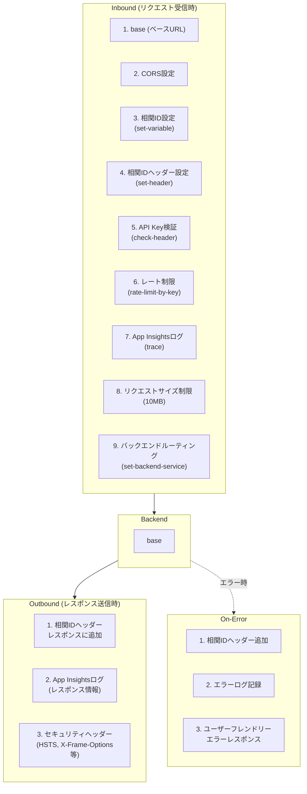
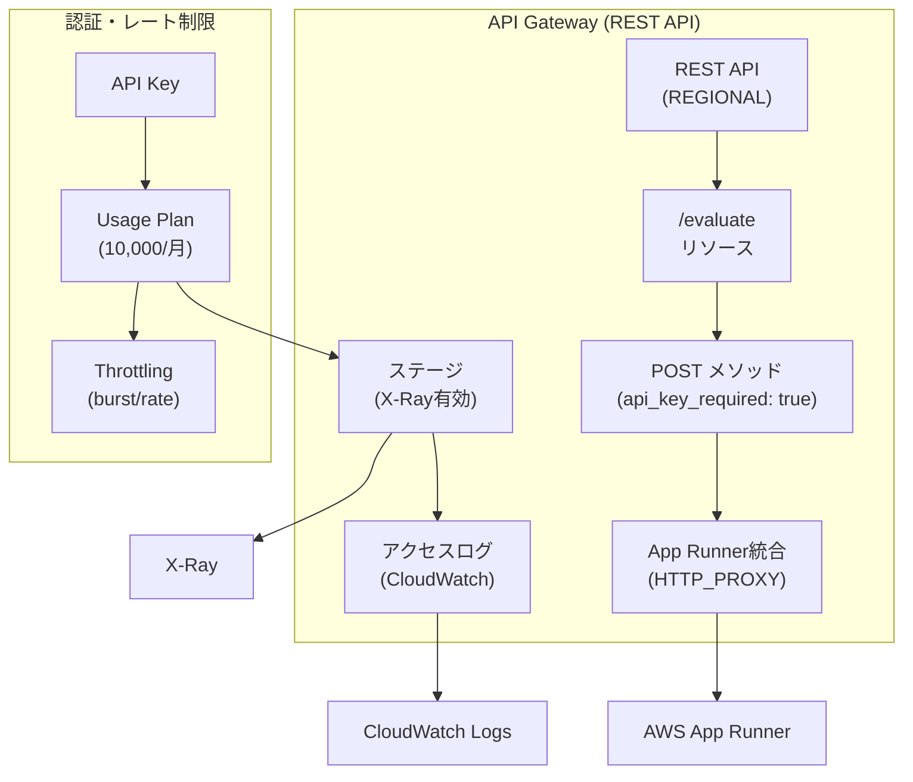
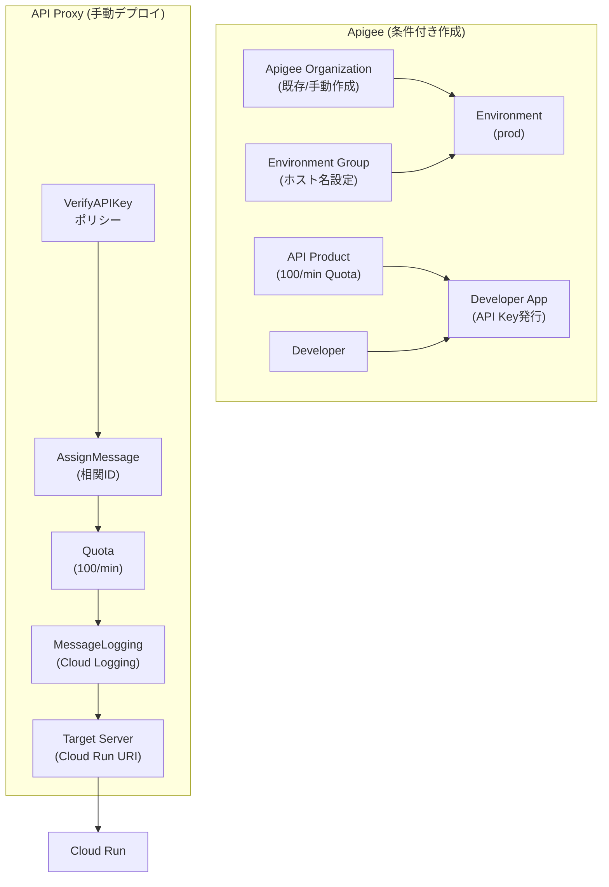
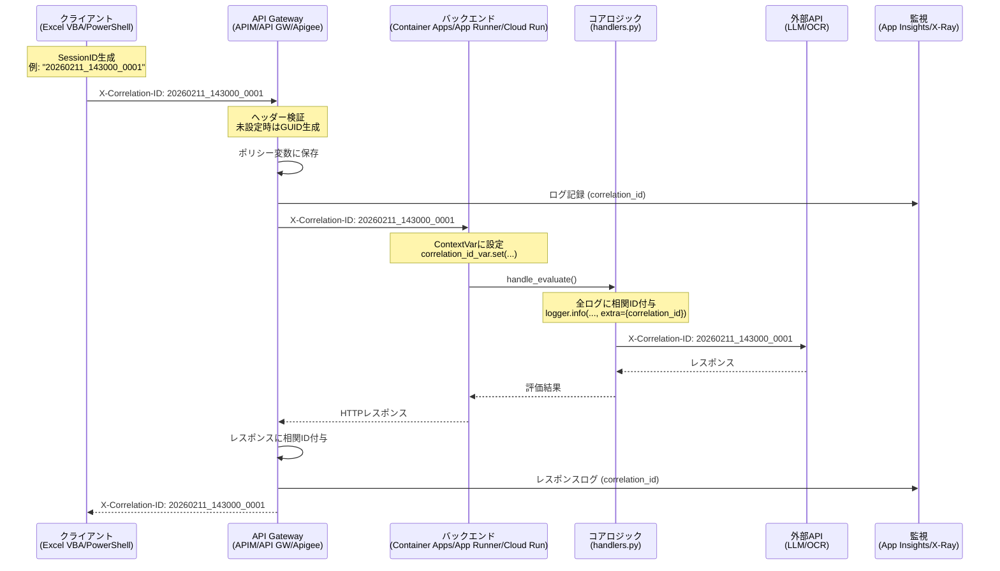

# API Gateway 設計書

**文書名**: 内部統制テスト評価AIシステム API Gateway 設計書
**バージョン**: 3.1.0-multiplatform
**最終更新日**: 2026-02-14
**対象読者**: インフラ担当者、セキュリティ担当者、開発者

---

## 目次

1. [API Gateway設計概要](#1-api-gateway設計概要)
2. [マルチクラウドAPI Gateway比較](#2-マルチクラウドapi-gateway比較)
3. [Azure APIM詳細設計](#3-azure-apim詳細設計)
4. [AWS API Gateway詳細設計](#4-aws-api-gateway詳細設計)
5. [GCP Apigee詳細設計](#5-gcp-apigee詳細設計)
6. [相関ID伝播](#6-相関id伝播)
7. [レート制限設計](#7-レート制限設計)
8. [エンドポイント一覧](#8-エンドポイント一覧)
9. [Terraform実装リファレンス](#9-terraform実装リファレンス)

---

## 1. API Gateway設計概要

### 1.1 API Gatewayの役割

API Gatewayは、外部クライアント（Excel VBA、PowerShell）とバックエンド（Azure Container Apps、AWS App Runner、GCP Cloud Run）の間に位置するリバースプロキシである。以下の横断的関心事を一元的に処理することで、バックエンドの実装を簡素化し、セキュリティと可観測性を担保する。



### 1.2 North-South vs East-West トラフィック

本システムにおいて、API Gatewayは**North-Southトラフィック**（クライアントからサーバーへの外部通信）のみを制御する。バックエンドから外部AIサービス（LLM API、OCR API）への通信は**East-Westトラフィック**であり、API Gatewayの管理対象外とする。

| トラフィック種別 | 方向 | 制御レイヤー | 認証方式 |
|----------------|------|------------|---------|
| **North-South** | クライアント -> API Gateway -> バックエンド | API Gateway | API Key (Subscription Key) |
| **East-West** | バックエンド -> LLM API / OCR API | バックエンド内部 | サービスAPI Key (シークレット経由) |
| **East-West** | バックエンド -> Key Vault / Secrets Manager | バックエンド内部 | Managed Identity / IAM Role |

### 1.3 設計判断の根拠

API Gatewayを採用した理由を以下に示す。

| 要件 | API Gatewayなし | API Gatewayあり |
|------|---------------|----------------|
| **認証** | 各Functionで個別実装 | Gateway層で一元管理 |
| **レート制限** | アプリケーション内で実装 | インフラ層で宣言的に設定 |
| **相関ID** | 各エントリポイントで個別管理 | ポリシーで統一的に注入 |
| **ログ** | アプリケーションログのみ | リクエスト/レスポンスを自動記録 |
| **セキュリティヘッダー** | ミドルウェアで追加 | ポリシーで統一設定 |
| **CORS** | フレームワーク依存 | 宣言的に設定 |

---

## 2. マルチクラウドAPI Gateway比較

### 2.1 機能比較表

| 機能 | Azure APIM | AWS API Gateway | GCP Apigee |
|------|-----------|----------------|------------|
| **タイプ** | フルマネージドAPI管理 | マネージドHTTP/REST API | エンタープライズAPI管理 |
| **採用SKU/プラン** | Consumption | REST API | eval/pay-as-you-go |
| **認証方式** | Subscription Key (Ocp-Apim-Subscription-Key) | API Key (x-api-key) + Usage Plan | API Key (VerifyAPIKey Policy) |
| **レート制限** | rate-limit-by-key ポリシー | Usage Plan + Method Throttling | Quota ポリシー |
| **バックエンド統合** | Container App URL直接指定 | App Runner URL直接指定 | Target Server + API Proxy |
| **ログ統合** | Application Insights (W3C) | CloudWatch Logs + X-Ray | Cloud Logging |
| **IaC** | Terraform | Terraform | Terraform |
| **CORS** | cors ポリシー | OPTIONS Mock統合 | CORS ポリシー |
| **相関ID** | set-variable + set-header | Request Parameter Mapping | AssignMessage |
| **TLS** | TLS 1.2+ (SSL3.0/TLS1.0/1.1明示無効) | TLS 1.2+ | TLS 1.2+ |
| **ID体系** | Managed Identity (SystemAssigned) | IAM Role | Service Account |
| **コスト** | 従量課金（100万コール/月 含む） | 従量課金（REST API） | 高額（月額$4.50～） |
| **備考** | 本システムの主要対象 | App Runner直接統合 | 高コストのため条件付き有効化 |

### 2.2 プラットフォーム選定指針

| 条件 | 推奨プラットフォーム | 理由 |
|------|-------------------|------|
| Azure AI Foundryを使用 | Azure APIM | 同一クラウド内の通信でレイテンシ最小化 |
| Bedrockを使用 | AWS API Gateway | App Runnerとの統合が簡素 |
| Vertex AIを使用 | GCP (Cloud Run直接) | Apigee高コストのため、直接アクセスを推奨 |
| 開発/テスト環境 | ローカル (FastAPI) | API Gatewayなし、直接呼び出し |

---

## 3. Azure APIM詳細設計

### 3.1 リソース構成



**Terraform リソース定義:**

```hcl
resource "azurerm_api_management" "main" {
  name                = local.apim_name
  location            = data.azurerm_resource_group.main.location
  resource_group_name = data.azurerm_resource_group.main.name
  publisher_email     = var.apim_publisher_email
  publisher_name      = var.apim_publisher_name
  sku_name            = "Consumption_0"  # 従量課金プラン

  identity {
    type = "SystemAssigned"  # マネージドID（Key Vault/Container Apps連携用）
  }

  security {
    enable_backend_ssl30  = false
    enable_backend_tls10  = false
    enable_backend_tls11  = false
    enable_frontend_ssl30 = false
    enable_frontend_tls10 = false
    enable_frontend_tls11 = false
  }
}
```

### 3.2 API定義（6エンドポイント）

| # | メソッド | パス | 説明 | リクエスト | レスポンス |
|---|--------|------|------|----------|----------|
| 1 | POST | `/api/evaluate` | 同期評価実行 | `[{ID, ControlDescription, TestProcedure, EvidenceFiles}]` | `[{ID, evaluationResult, judgmentBasis, ...}]` |
| 2 | POST | `/api/evaluate/submit` | 非同期ジョブ送信 | `[{items}]` | `{job_id, status: "pending", estimated_time}` |
| 3 | GET | `/api/evaluate/status/{job_id}` | ジョブステータス確認 | - | `{job_id, status, progress, message}` |
| 4 | GET | `/api/evaluate/results/{job_id}` | ジョブ結果取得 | - | `{job_id, status, results: [...]}` |
| 5 | GET | `/api/health` | ヘルスチェック | - | `{status, version, llm, ocr, platform}` |
| 6 | GET | `/api/config` | 設定状態確認 | - | `{llm, ocr, orchestrator}` |

### 3.3 認証設計



**認証モデル:**

| 概念 | 説明 |
|------|------|
| **Product** | APIのパッケージ。`ic-test-ai-product`として公開。`subscriptionRequired: true` |
| **Subscription** | Productへのアクセス権。`ic-test-ai-subscription`として発行。Primary Key/Secondary Keyの2キー体制 |
| **API Key検証** | `Ocp-Apim-Subscription-Key`ヘッダーまたは`subscription-key`クエリパラメータで認証 |

**APIMポリシー（check-header）:**

```xml
<check-header name="Ocp-Apim-Subscription-Key"
             failed-check-httpcode="401"
             failed-check-error-message="Unauthorized: Subscription Key is required"
             ignore-case="false" />
```

### 3.4 ポリシー設計

APIMポリシーは`infrastructure/azure/apim-policies.xml`で定義され、以下の4フェーズで構成される。



#### 3.4.1 相関ID注入ポリシー

```xml
<!-- ヘッダーから取得、なければGUID生成 -->
<set-variable name="correlation-id"
              value="@{
                  string correlationId = context.Request.Headers
                      .GetValueOrDefault("X-Correlation-ID", "");
                  if (string.IsNullOrEmpty(correlationId))
                  {
                      correlationId = Guid.NewGuid().ToString();
                  }
                  return correlationId;
              }" />

<!-- バックエンドに転送 -->
<set-header name="X-Correlation-ID" exists-action="override">
    <value>@((string)context.Variables["correlation-id"])</value>
</set-header>
```

#### 3.4.2 レート制限ポリシー

```xml
<!-- IPアドレスベース: 100コール/60秒 -->
<rate-limit-by-key calls="100"
                  renewal-period="60"
                  counter-key="@(context.Request.IpAddress)"
                  increment-condition="@(context.Response.StatusCode >= 200
                      && context.Response.StatusCode < 300)" />
```

#### 3.4.3 CORS設定

```xml
<cors allow-credentials="false">
    <allowed-origins>
        <origin>*</origin>
    </allowed-origins>
    <allowed-methods>
        <method>GET</method>
        <method>POST</method>
        <method>OPTIONS</method>
    </allowed-methods>
    <allowed-headers>
        <header>*</header>
    </allowed-headers>
    <expose-headers>
        <header>X-Correlation-ID</header>
    </expose-headers>
</cors>
```

#### 3.4.4 セキュリティヘッダー（Outbound）

```xml
<set-header name="X-Content-Type-Options" exists-action="override">
    <value>nosniff</value>
</set-header>
<set-header name="X-Frame-Options" exists-action="override">
    <value>DENY</value>
</set-header>
<set-header name="Strict-Transport-Security" exists-action="override">
    <value>max-age=31536000; includeSubDomains</value>
</set-header>
```

#### 3.4.5 エラーレスポンス（On-Error）

ステータスコードに応じた日本語ユーザーメッセージを返却する。

| ステータス | メッセージ |
|-----------|----------|
| 401 | 認証に失敗しました。API Keyを確認してください。 |
| 403 | このリソースへのアクセス権限がありません。 |
| 404 | 指定されたエンドポイントが見つかりません。 |
| 413 | リクエストサイズが大きすぎます（最大10MB）。 |
| 429 | リクエスト制限を超えました。しばらくしてから再試行してください。 |
| 500/502/503/504 | サーバーエラーが発生しました。しばらくしてから再試行してください。 |

### 3.5 診断ログ設定

```bicep
resource apiDiagnostic 'Microsoft.ApiManagement/service/apis/diagnostics@2023-05-01-preview' = {
  parent: api
  name: 'applicationinsights'
  properties: {
    loggerId: apimLogger.id
    alwaysLog: 'allErrors'              // 全エラーを常にログ
    logClientIp: true                   // クライアントIPを記録
    httpCorrelationProtocol: 'W3C'      // W3C相関プロトコル
    verbosity: 'information'            // INFO以上をログ
    sampling: {
      samplingType: 'fixed'
      percentage: 100                   // 全リクエスト（100%サンプリング）
    }
    frontend: {
      request: {
        headers: ['X-Correlation-ID', 'User-Agent']
        body: { bytes: 8192 }          // リクエストボディ最大8KB記録
      }
      response: {
        headers: ['X-Correlation-ID']
        body: { bytes: 8192 }          // レスポンスボディ最大8KB記録
      }
    }
    backend: {
      request: {
        headers: ['X-Correlation-ID']
        body: { bytes: 8192 }
      }
      response: {
        headers: ['X-Correlation-ID']
        body: { bytes: 8192 }
      }
    }
  }
}
```

### 3.6 セキュリティ設定

| 設定項目 | 値 | 根拠 |
|---------|---|------|
| TLS 1.0 | **無効** | レガシープロトコル、脆弱性あり |
| TLS 1.1 | **無効** | 非推奨、PCI DSS非準拠 |
| SSL 3.0 | **無効** | POODLE脆弱性 |
| TLS 1.2 | **有効** | 現行標準 |
| バックエンドTLS 1.0/1.1 | **無効** | APIM-Functions間通信も同様に保護 |
| Managed Identity | **SystemAssigned** | Key Vault/Functions連携で使用 |

---

## 4. AWS API Gateway詳細設計

### 4.1 リソース構成



### 4.2 App Runner HTTP統合

AWS API Gatewayでは**HTTP Proxy統合（HTTP_PROXY）** を採用する。この統合方式では、HTTPリクエストがそのままApp RunnerのエンドポイントURLに転送されるため、API Gateway側でのマッピングテンプレートが不要となる。

```hcl
resource "aws_api_gateway_integration" "evaluate_apprunner" {
  rest_api_id             = aws_api_gateway_rest_api.ic_test_ai.id
  resource_id             = aws_api_gateway_resource.evaluate.id
  http_method             = aws_api_gateway_method.evaluate_post.http_method
  integration_http_method = "POST"
  type                    = "HTTP_PROXY"
  uri                     = "${aws_apprunner_service.ic_test_ai.service_url}/evaluate"
}
```

### 4.3 API Key + Usage Plan

```hcl
resource "aws_api_gateway_usage_plan" "ic_test_ai" {
  name = "${var.project_name}-${var.environment}-usage-plan"

  api_stages {
    api_id = aws_api_gateway_rest_api.ic_test_ai.id
    stage  = aws_api_gateway_stage.prod.stage_name
  }

  # 月間クォータ
  quota_settings {
    limit  = 10000    # 10,000リクエスト/月
    period = "MONTH"
  }

  # スロットリング
  throttle_settings {
    burst_limit = var.api_gateway_throttle_burst_limit  # バースト上限
    rate_limit  = var.api_gateway_throttle_rate_limit   # 定常レート上限
  }
}
```

### 4.4 X-Rayトレーシング

ステージレベルでX-Rayトレーシングを有効化する。

```hcl
resource "aws_api_gateway_stage" "prod" {
  deployment_id        = aws_api_gateway_deployment.ic_test_ai.id
  rest_api_id          = aws_api_gateway_rest_api.ic_test_ai.id
  stage_name           = var.environment
  xray_tracing_enabled = var.enable_xray_tracing  # X-Ray有効化
}
```

### 4.5 アクセスログ形式

```json
{
    "requestId": "$context.requestId",
    "ip": "$context.identity.sourceIp",
    "caller": "$context.identity.caller",
    "user": "$context.identity.user",
    "requestTime": "$context.requestTime",
    "httpMethod": "$context.httpMethod",
    "resourcePath": "$context.resourcePath",
    "status": "$context.status",
    "protocol": "$context.protocol",
    "responseLength": "$context.responseLength",
    "correlationId": "$context.requestId"
}
```

### 4.6 相関IDの扱い

AWS API Gatewayでは、`X-Correlation-ID`ヘッダーをリクエストパラメータとして定義し、Lambda Proxy統合を通じてLambdaに転送する。

```hcl
resource "aws_api_gateway_method" "evaluate_post" {
  # ...
  request_parameters = {
    "method.request.header.X-Correlation-ID" = false  # オプショナル
  }
}
```

App Runner側では、FastAPIミドルウェアで`X-Correlation-ID`ヘッダーを取得し、ContextVarに設定する。

---

## 5. GCP Apigee詳細設計

### 5.1 設計方針

Apigeeは高コスト（月額$4.50以上）であるため、本システムでは**条件付き有効化**（`enable_apigee`変数）を採用する。Apigee無効時はCloud Runへの直接アクセスとなり、相関ID管理・レート制限はCloud Run内で実装する。

### 5.2 リソース構成



### 5.3 API Product設定

```hcl
resource "google_apigee_product" "ic_test_ai" {
  count        = var.enable_apigee ? 1 : 0
  org_id       = data.google_apigee_organization.org[0].name
  name         = "${var.project_name}-${var.environment}-product"
  display_name = "IC Test AI Product"
  approval_type = "auto"

  # レート制限
  quota           = "100"      # 100リクエスト
  quota_interval  = "1"        # 1分間あたり
  quota_time_unit = "minute"

  # アクセススコープ
  scopes = ["read", "write"]

  # APIリソースパス
  api_resources = ["/**"]
}
```

### 5.4 Developer App（API Key発行）

```hcl
resource "google_apigee_developer_app" "ic_test_ai" {
  count        = var.enable_apigee ? 1 : 0
  org_id       = data.google_apigee_organization.org[0].name
  developer_id = google_apigee_developer.default[0].email
  name         = "${var.project_name}-${var.environment}-app"
  api_products = [google_apigee_product.ic_test_ai[0].name]
}
```

### 5.5 API Proxyポリシー構成（XML定義）

Apigee API ProxyはXML形式で定義され、Terraform管理外として手動またはCI/CDでデプロイする。主要ポリシーは以下の通り。

| ポリシー | 種別 | 説明 |
|---------|------|------|
| **VerifyAPIKey** | セキュリティ | API Keyの検証。Developer Appに紐づくキーのみ許可 |
| **AssignMessage** | メディエーション | `X-Correlation-ID`ヘッダーの設定（未設定時はUUID生成） |
| **Quota** | トラフィック管理 | レート制限（API Productの設定に準拠） |
| **MessageLogging** | ロギング | Cloud Loggingへの構造化ログ出力 |

### 5.6 Apigee不使用時の代替

Apigee無効時（`enable_apigee = false`）は、以下の構成で同等機能を実現する。

| 機能 | 代替実装 |
|------|---------|
| 認証 | Cloud Run内でAPI Keyヘッダーを検証 |
| レート制限 | Cloud Armor + Cloud Load Balancer、またはアプリケーション内実装 |
| 相関ID | Cloud Run内で`X-Correlation-ID`ヘッダーを処理 |
| ログ | Cloud Run標準ログ + Cloud Logging |

---

## 6. 相関ID伝播

### 6.1 相関IDフロー全体図



### 6.2 プラットフォーム別の相関ID処理

| プラットフォーム | 取得方法 | 生成方法（未設定時） | バックエンド転送 | レスポンス付与 |
|---------------|---------|-------------------|---------------|-------------|
| **Azure APIM** | `context.Request.Headers.GetValueOrDefault("X-Correlation-ID", "")` | `Guid.NewGuid().ToString()` | `set-header` ポリシー | `set-header` ポリシー |
| **AWS API GW** | `request.headers["X-Correlation-ID"]` | FastAPI内で`uuid.uuid4()` | HTTP Proxy統合で自動 | FastAPIレスポンスヘッダー |
| **GCP Apigee** | `request.header.X-Correlation-ID` | `AssignMessage`で`java.util.UUID.randomUUID()` | `AssignMessage`でTarget転送 | `AssignMessage`でレスポンス設定 |

### 6.3 バックエンド内部での相関ID管理

```python
# correlation.py
from contextvars import ContextVar

# スレッドセーフなContextVarで管理
correlation_id_var: ContextVar[Optional[str]] = ContextVar('correlation_id', default=None)

def get_or_create_correlation_id(headers: Dict[str, str]) -> str:
    """HTTPヘッダーから相関IDを取得、なければUUID生成"""
    correlation_id = None
    for key, value in headers.items():
        if key.lower() == 'x-correlation-id':
            correlation_id = value
            break
    if not correlation_id:
        correlation_id = str(uuid.uuid4())
    correlation_id_var.set(correlation_id)
    return correlation_id

def get_correlation_id() -> Optional[str]:
    """現在のコンテキストの相関IDを取得"""
    return correlation_id_var.get()
```

---

## 7. レート制限設計

### 7.1 レート制限戦略

| プラットフォーム | 制限単位 | 制限値 | 期間 | 超過時レスポンス |
|---------------|---------|--------|------|----------------|
| **Azure APIM** | IPアドレス | 100コール | 60秒 | 429 Too Many Requests |
| **AWS API GW** | API Key | 可変 (変数) | バースト/定常 | 429 Too Many Requests |
| **GCP Apigee** | API Product | 100コール | 1分 | 429 Too Many Requests |

### 7.2 Azure APIMのレート制限詳細

```xml
<rate-limit-by-key
    calls="100"
    renewal-period="60"
    counter-key="@(context.Request.IpAddress)"
    increment-condition="@(context.Response.StatusCode >= 200
        &amp;&amp; context.Response.StatusCode &lt; 300)" />
```

| パラメータ | 値 | 説明 |
|-----------|---|------|
| `calls` | 100 | 許可されるコール数 |
| `renewal-period` | 60 | リセット間隔（秒） |
| `counter-key` | IPアドレス | カウンターのキー（IP別にカウント） |
| `increment-condition` | 成功レスポンスのみ | 2xx系レスポンスの場合のみカウントを増加 |

**調整指針:**
- 通常運用時: 100コール/60秒（内部統制テストの評価頻度に十分）
- 大量バッチ処理時: 非同期API（/evaluate/submit）を使用し、レート制限を回避
- 負荷テスト時: 一時的に制限値を引き上げ

### 7.3 AWS API Gatewayのスロットリング

```hcl
resource "aws_api_gateway_method_settings" "all" {
  settings {
    throttling_burst_limit = var.api_gateway_throttle_burst_limit  # バースト上限
    throttling_rate_limit  = var.api_gateway_throttle_rate_limit   # 定常レート
  }
}

resource "aws_api_gateway_usage_plan" "ic_test_ai" {
  quota_settings {
    limit  = 10000    # 月間クォータ
    period = "MONTH"
  }
  throttle_settings {
    burst_limit = var.api_gateway_throttle_burst_limit
    rate_limit  = var.api_gateway_throttle_rate_limit
  }
}
```

### 7.4 GCP Apigeeのクォータ

```hcl
resource "google_apigee_product" "ic_test_ai" {
  quota           = "100"      # 100リクエスト
  quota_interval  = "1"        # 間隔
  quota_time_unit = "minute"   # 単位: 分
}
```

---

## 8. エンドポイント一覧

### 8.1 エンドポイント定義表

| # | メソッド | パス | 説明 | 認証 | レート制限 | 同期/非同期 |
|---|--------|------|------|------|----------|-----------|
| 1 | `POST` | `/api/evaluate` | テスト項目を同期的に評価 | Subscription Key | 100/60s | 同期 |
| 2 | `POST` | `/api/evaluate/submit` | 評価ジョブを送信（即時返却） | Subscription Key | 100/60s | 非同期 |
| 3 | `GET` | `/api/evaluate/status/{job_id}` | ジョブのステータスを確認 | Subscription Key | 100/60s | 同期 |
| 4 | `GET` | `/api/evaluate/results/{job_id}` | ジョブの評価結果を取得 | Subscription Key | 100/60s | 同期 |
| 5 | `GET` | `/api/health` | ヘルスチェック | Subscription Key | 100/60s | 同期 |
| 6 | `GET` | `/api/config` | 設定状態の確認 | Subscription Key | 100/60s | 同期 |

### 8.2 リクエスト/レスポンス仕様

#### POST /api/evaluate

**リクエスト:**
```json
[
    {
        "ID": "TC-001",
        "ControlDescription": "経費精算は上長の承認を得てから実行される",
        "TestProcedure": "承認済みの経費精算申請書と実際の支払記録を照合する",
        "EvidenceFiles": [
            {
                "fileName": "expense_approval_202601.pdf",
                "content": "<Base64エンコード済みコンテンツ>"
            }
        ]
    }
]
```

**レスポンス (200):**
```json
[
    {
        "ID": "TC-001",
        "evaluationResult": true,
        "executionPlanSummary": "【A5:意味的推論】\n統制要件と実施記録の整合性を...",
        "judgmentBasis": "経費精算申請書を閲覧した。上長承認欄に...",
        "documentReference": "[expense_approval_202601.pdf] 承認欄：\n部長 山田太郎 2026/01/15",
        "fileName": "expense_approval_202601.pdf",
        "evidenceFiles": [{"fileName": "expense_approval_202601.pdf", "filePath": "..."}],
        "_debug": {
            "confidence": 0.92,
            "planReviewSummary": "網羅性: 8/10, 効率性: 9/10",
            "judgmentReviewSummary": "レビュー結果: 承認"
        }
    }
]
```

#### POST /api/evaluate/submit

**レスポンス (202):**
```json
{
    "job_id": "a1b2c3d4-e5f6-7890-abcd-ef1234567890",
    "status": "pending",
    "estimated_time": 180,
    "message": "Job submitted successfully"
}
```

#### GET /api/evaluate/status/{job_id}

**レスポンス (200):**
```json
{
    "job_id": "a1b2c3d4-e5f6-7890-abcd-ef1234567890",
    "status": "running",
    "progress": 50,
    "message": "3/6 items processed"
}
```

#### GET /api/health

**レスポンス (200):**
```json
{
    "status": "healthy",
    "version": "3.1.0-multiplatform",
    "response_time_ms": 45.2,
    "timestamp": "2026-02-14T12:00:00",
    "llm": {
        "provider": "azure",
        "configured": true,
        "model": "gpt-5-nano"
    },
    "ocr": {
        "provider": "azure_document_intelligence",
        "configured": true
    },
    "features": {
        "self_reflection": true,
        "multi_cloud_ocr": true,
        "multi_cloud_llm": true
    },
    "platform": "Azure Container Apps"
}
```

### 8.3 共通HTTPヘッダー

**リクエストヘッダー:**

| ヘッダー | 必須 | 説明 |
|---------|------|------|
| `Ocp-Apim-Subscription-Key` | Yes (Azure) | APIMサブスクリプションキー |
| `x-api-key` | Yes (AWS) | API Gatewayキー |
| `X-Correlation-ID` | No | 相関ID（未設定時は自動生成） |
| `Content-Type` | Yes (POST) | `application/json` |

**レスポンスヘッダー:**

| ヘッダー | 説明 |
|---------|------|
| `X-Correlation-ID` | リクエストの相関ID（トラブルシューティング用） |
| `X-Content-Type-Options` | `nosniff` |
| `X-Frame-Options` | `DENY` |
| `Strict-Transport-Security` | `max-age=31536000; includeSubDomains` |
| `Content-Type` | `application/json; charset=utf-8` |

---

## 9. Terraform実装リファレンス

### 9.1 ファイル一覧

| プラットフォーム | ファイル | パス | 主要リソース |
|---------------|---------|------|------------|
| **Azure** | `apim.tf` | `infrastructure/azure/terraform/apim.tf` | APIM, API, Operations, Subscription, Product, Diagnostic |
| **Azure** | `container-apps.tf` | `infrastructure/azure/terraform/container-apps.tf` | ACR, Container Apps Environment, Container App |
| **Azure** | `cognitive-services.tf` | `infrastructure/azure/terraform/cognitive-services.tf` | Azure AI Foundry, Document Intelligence |
| **Azure** | `storage.tf` | `infrastructure/azure/terraform/storage.tf` | Storage Account (非同期ジョブ) |
| **Azure** | `key-vault.tf` | `infrastructure/azure/terraform/key-vault.tf` | Key Vault, Access Policies |
| **Azure** | `monitoring.tf` | `infrastructure/azure/terraform/monitoring.tf` | Log Analytics, App Insights |
| **Azure** | `variables.tf` | `infrastructure/azure/terraform/variables.tf` | 変数定義 |
| **Azure** | `terraform.tfvars` | `infrastructure/azure/terraform/terraform.tfvars` | パラメータ値 |
| **AWS** | `api-gateway.tf` | `infrastructure/aws/terraform/api-gateway.tf` | REST API, App Runner統合, API Key, Usage Plan |
| **AWS** | `app-runner.tf` | `infrastructure/aws/terraform/app-runner.tf` | App Runner, ECR, IAM Role |
| **AWS** | `storage.tf` | `infrastructure/aws/terraform/storage.tf` | DynamoDB, SQS (非同期ジョブ) |
| **AWS** | `secrets-manager.tf` | `infrastructure/aws/terraform/secrets-manager.tf` | Secrets Manager |
| **AWS** | `cloudwatch.tf` | `infrastructure/aws/terraform/cloudwatch.tf` | CloudWatch Logs, Alarms |
| **AWS** | `variables.tf` | `infrastructure/aws/terraform/variables.tf` | 変数定義 |
| **AWS** | `outputs.tf` | `infrastructure/aws/terraform/outputs.tf` | 出力値 |
| **GCP** | `apigee.tf` | `infrastructure/gcp/terraform/apigee.tf` | Apigee Environment, Product, Developer App |
| **GCP** | `cloud-run.tf` | `infrastructure/gcp/terraform/cloud-run.tf` | Cloud Run, Artifact Registry |
| **GCP** | `storage.tf` | `infrastructure/gcp/terraform/storage.tf` | Firestore, Cloud Tasks (非同期ジョブ) |
| **GCP** | `secret-manager.tf` | `infrastructure/gcp/terraform/secret-manager.tf` | Secret Manager |
| **GCP** | `cloud-logging.tf` | `infrastructure/gcp/terraform/cloud-logging.tf` | Cloud Logging |
| **GCP** | `variables.tf` | `infrastructure/gcp/terraform/variables.tf` | 変数定義 |
| **GCP** | `outputs.tf` | `infrastructure/gcp/terraform/outputs.tf` | 出力値 |

### 9.2 デプロイ手順

#### Azure

```bash
# 1. リソースグループ作成
az group create --name rg-ic-test-ai-prod --location japaneast

# 2. Terraformデプロイ（APIM、Container Apps、Cognitive Services、Storage等を一括作成）
cd infrastructure/azure/terraform
terraform init
terraform plan -out=tfplan -var="resource_group_name=rg-ic-test-ai-prod"
terraform apply -auto-approve tfplan

# 3. Container Appにイメージデプロイ
ACR_NAME=$(terraform output -raw acr_name)
docker build -t "$ACR_NAME.azurecr.io/ic-test-ai:latest" .
docker push "$ACR_NAME.azurecr.io/ic-test-ai:latest"
CONTAINER_APP_NAME=$(terraform output -raw container_app_name)
az containerapp update --name $CONTAINER_APP_NAME --resource-group rg-ic-test-ai-prod \
  --image "$ACR_NAME.azurecr.io/ic-test-ai:latest"
```

#### AWS

```bash
# 1. Terraform初期化
cd infrastructure/aws/terraform
terraform init

# 2. プランニング
terraform plan -var-file="production.tfvars"

# 3. デプロイ
terraform apply -var-file="production.tfvars"

# 4. API KeyとエンドポイントURLを取得
terraform output api_gateway_url
terraform output api_key_value
```

#### GCP

```bash
# 1. Terraform初期化
cd infrastructure/gcp/terraform
terraform init

# 2. Apigee有効/無効を設定
# variables.tf の enable_apigee を確認

# 3. デプロイ
terraform plan -var-file="production.tfvars"
terraform apply -var-file="production.tfvars"

# 4. Cloud Functions URLを取得
terraform output cloud_functions_direct_url
```

### 9.3 主要パラメータ

#### Azure (parameters.json)

| パラメータ | 型 | デフォルト | 説明 |
|-----------|---|----------|------|
| `projectName` | string | - | プロジェクト名（リソース名プレフィックス） |
| `environment` | string (dev/stg/prod) | - | 環境名 |
| `apimPublisherEmail` | string | - | APIM発行者メールアドレス |
| `apimSkuName` | string | Consumption | APIM SKU |
| `pythonVersion` | string | 3.11 | Python バージョン |

#### AWS (variables.tf)

| 変数 | 型 | 説明 |
|------|---|------|
| `project_name` | string | プロジェクト名 |
| `environment` | string | 環境名 |
| `api_gateway_throttle_burst_limit` | number | バースト上限 |
| `api_gateway_throttle_rate_limit` | number | 定常レート上限 |
| `enable_xray_tracing` | bool | X-Rayトレーシング有効化 |
| `cloudwatch_log_retention_days` | number | ログ保持日数 |

#### GCP (variables.tf)

| 変数 | 型 | 説明 |
|------|---|------|
| `project_id` | string | GCPプロジェクトID |
| `project_name` | string | プロジェクト名 |
| `environment` | string | 環境名 |
| `enable_apigee` | bool | Apigee有効化フラグ |
| `apigee_organization_name` | string | Apigee組織名 |
| `apigee_environment_name` | string | Apigee環境名 |

---

## 付録

### A. トラブルシューティング

| 症状 | 原因 | 対処 |
|------|------|------|
| 401 Unauthorized | API Key未設定/無効 | Subscription Key / API Keyを確認 |
| 429 Too Many Requests | レート制限超過 | 非同期API(/evaluate/submit)を使用、または制限値を調整 |
| 413 Payload Too Large | リクエストボディ > 10MB | 証跡ファイルを分割、またはファイルサイズを削減 |
| 504 Gateway Timeout | バックエンド処理タイムアウト | 非同期API使用、タイムアウト値の調整 |
| 相関IDがログに表示されない | ヘッダー伝播の設定不備 | APIM診断設定でX-Correlation-IDヘッダーの記録を確認 |

### B. 参照文書

- [システムアーキテクチャ設計書](./SYSTEM_ARCHITECTURE.md)
- Azure APIM公式ドキュメント: https://learn.microsoft.com/ja-jp/azure/api-management/
- AWS API Gateway公式ドキュメント: https://docs.aws.amazon.com/apigateway/
- GCP Apigee公式ドキュメント: https://cloud.google.com/apigee/docs
