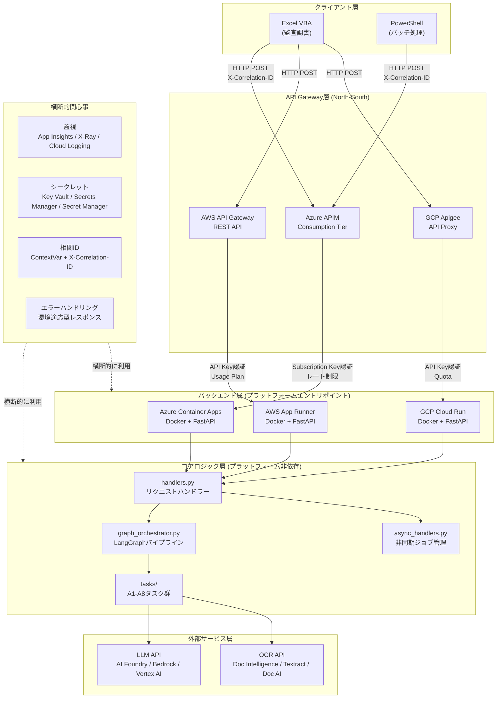
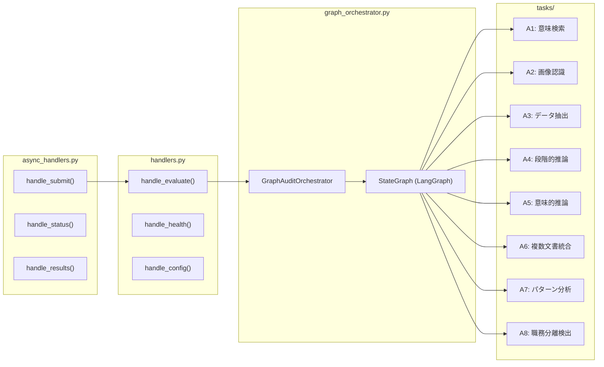
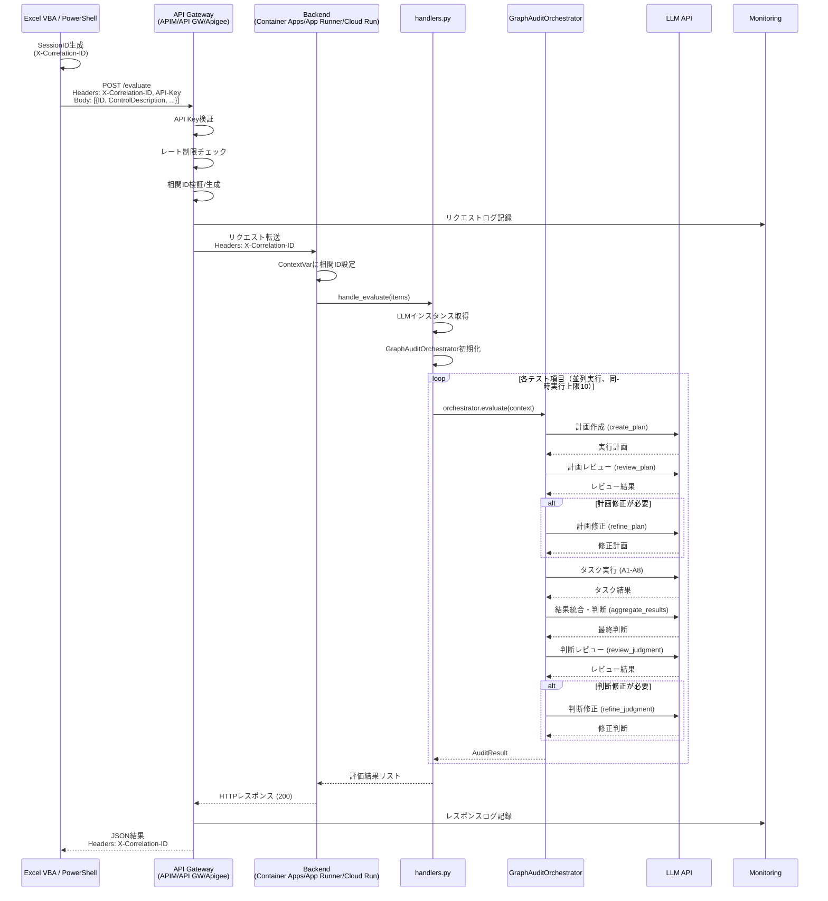
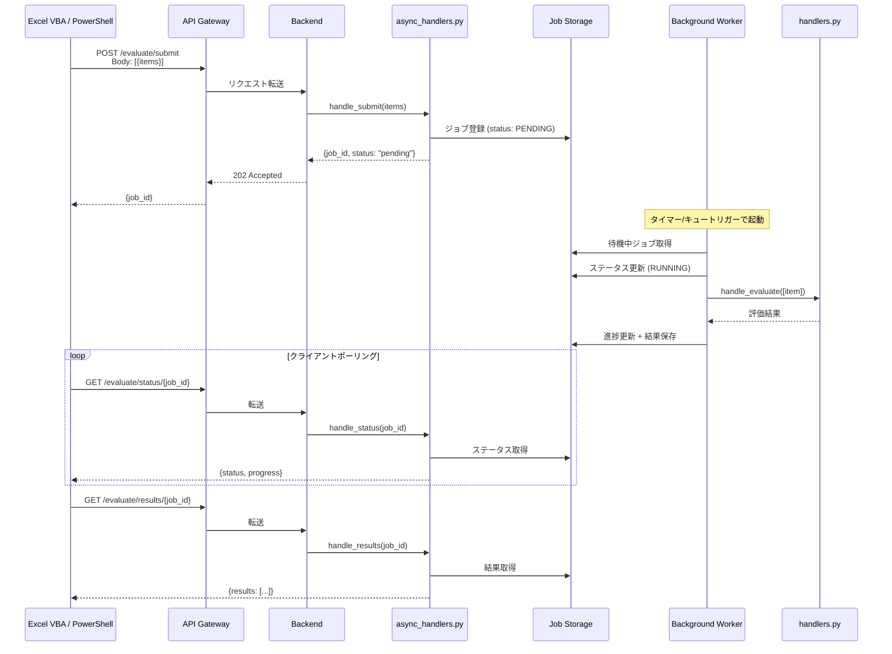
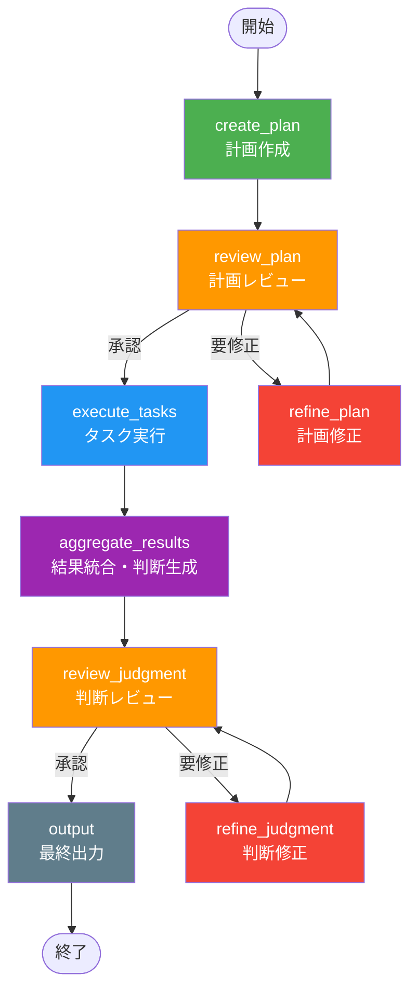
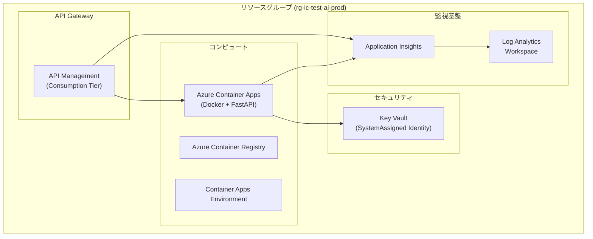

# システムアーキテクチャ設計書

**文書名**: 内部統制テスト評価AIシステム アーキテクチャ設計書
**バージョン**: 2.4.0-multiplatform
**最終更新日**: 2026-02-11
**対象読者**: 開発者、インフラ担当者、アーキテクト

---

## 目次

1. [システム概要](#1-システム概要)
2. [アーキテクチャ図](#2-アーキテクチャ図)
3. [コンポーネント詳細](#3-コンポーネント詳細)
4. [データフロー](#4-データフロー)
5. [LangGraphパイプライン詳細](#5-langgraphパイプライン詳細)
6. [デプロイメントアーキテクチャ](#6-デプロイメントアーキテクチャ)
7. [セキュリティアーキテクチャ](#7-セキュリティアーキテクチャ)
8. [監視アーキテクチャ](#8-監視アーキテクチャ)
9. [フォルダ構成](#9-フォルダ構成)

---

## 1. システム概要

### 1.1 目的

本システムは、内部統制テスト（J-SOX/SOX対応）の評価業務をAIで自動化するマルチクラウド対応のコンテナベースアプリケーションである。監査担当者が作成したテスト項目に対して、AI（LLM）が証跡ファイルを分析し、統制の有効性を判断する。

### 1.2 設計思想

本システムは以下の設計原則に基づいて構築されている。

| 原則 | 説明 |
|------|------|
| **プラットフォーム非依存** | コアロジックをクラウド固有のコードから分離し、Azure/AWS/GCP/ローカル環境で同一のビジネスロジックを実行可能にする |
| **セルフリフレクション** | LangGraphベースのパイプラインにより、計画・判断の自己レビューを行い、評価品質を担保する |
| **可観測性** | 相関IDによるリクエスト追跡、構造化ログ、カスタムメトリクスにより、本番環境での問題特定を容易にする |
| **エラー耐性** | どのようなエラーが発生しても、クライアントに対して常に有効なレスポンスを返す。個別項目のエラーは全体に波及しない |
| **環境適応** | 本番環境ではトレースバックを隠蔽し、開発環境では詳細なデバッグ情報を提供する |
| **段階的フォールバック** | LLM未設定時はモック評価、クラウドシークレット接続失敗時は環境変数フォールバックなど、常に稼働可能な状態を維持する |

### 1.3 対応クラウドプラットフォーム

| クラウド | API Gateway | コンピュート | シークレット管理 | 監視 | LLM | OCR |
|---------|------------|------------|---------------|------|-----|-----|
| **Azure** | API Management (APIM) | Azure Container Apps (ACR) | Key Vault | Application Insights | Azure AI Foundry | Document Intelligence |
| **AWS** | API Gateway | AWS App Runner (ECR) | Secrets Manager | X-Ray + CloudWatch | Bedrock | Textract |
| **GCP** | Apigee | GCP Cloud Run (Artifact Registry) | Secret Manager | Cloud Logging + Cloud Trace | Vertex AI | Document AI |

---

## 2. アーキテクチャ図

### 2.1 全体アーキテクチャ



### 2.2 コアロジック内部構成



---

## 3. コンポーネント詳細

### 3.1 クライアント層

クライアントはExcel VBAおよびPowerShellスクリプトで構成される。監査担当者はExcel監査調書から直接API呼び出しを行い、評価結果を取得する。

| クライアント | 用途 | 通信方式 |
|------------|------|---------|
| **Excel VBA** | 監査調書からの個別/一括評価実行、結果のセル書き戻し | HTTP POST (WinHTTP/XMLHTTP) |
| **PowerShell** | バッチ処理、CI/CD連携、自動化スクリプト | Invoke-RestMethod |

**クライアント側の責務:**
- SessionID（相関ID）の生成と`X-Correlation-ID`ヘッダーへの設定
- テスト項目のJSON整形（ID、統制記述、テスト手続き、証跡ファイルのBase64エンコード）
- 非同期モード時のポーリング処理（submit -> status -> results）
- APIキー（Subscription Key）の管理

### 3.2 API Gateway層

API Gatewayは外部ネットワーク（North-South）からのトラフィックを制御する。認証、レート制限、相関ID管理、ログ記録を担当する。

| 機能 | Azure APIM | AWS API Gateway | GCP Apigee |
|------|-----------|----------------|------------|
| **認証** | Subscription Key (Ocp-Apim-Subscription-Key) | API Key (x-api-key) | API Key (VerifyAPIKey) |
| **レート制限** | rate-limit-by-key (100/60s per IP) | Usage Plan + Throttling | Quota (100/min) |
| **相関ID** | set-variable + set-header ポリシー | Request Parameter Mapping | AssignMessage ポリシー |
| **ログ** | Application Insights (W3C) | CloudWatch Logs | Cloud Logging |
| **TLS** | TLS 1.2+のみ（SSL3.0/TLS1.0/1.1無効化） | TLS 1.2+ | TLS 1.2+ |
| **IaC** | Bicep (apim.bicep) | Terraform (api-gateway.tf) | Terraform (apigee.tf) |

### 3.3 バックエンド層

全プラットフォームで共通のDockerイメージ（FastAPI/Uvicorn）がエントリポイントとなる。`platforms/local/main.py`が共通のFastAPIアプリケーションを提供し、`platforms/local/Dockerfile`でコンテナ化される。

```
platforms/
  local/    -> 共通Dockerイメージ (FastAPI/Uvicorn)
    main.py      -> 全プラットフォーム共通エントリポイント
    Dockerfile   -> 共通コンテナビルド定義
  azure/    -> Azure Container Apps (ACR経由デプロイ)
  aws/      -> AWS App Runner (ECR経由デプロイ)
  gcp/      -> GCP Cloud Run (Artifact Registry経由デプロイ)
```

**バックエンド層の責務:**
- FastAPIによるHTTPリクエストの受信・レスポンス返却
- `X-Correlation-ID`ヘッダーの取得とContextVarへの設定
- `handlers.py`の共通関数呼び出し
- 全プラットフォームで同一のAPIパス（`/evaluate`, `/health`, `/config`）を提供

### 3.4 コアロジック層

プラットフォームに依存しないビジネスロジック群。全クラウド共通で利用される。

| モジュール | 役割 | 主要クラス/関数 |
|-----------|------|---------------|
| `handlers.py` | 評価リクエストの受付、LLM初期化、並列評価制御 | `handle_evaluate()`, `handle_health()`, `handle_config()` |
| `async_handlers.py` | 非同期ジョブ管理（submit/status/results） | `handle_submit()`, `handle_status()`, `handle_results()` |
| `graph_orchestrator.py` | LangGraphによるセルフリフレクション付き評価パイプライン | `GraphAuditOrchestrator` |
| `tasks/base_task.py` | タスク基底クラスとデータモデル | `BaseAuditTask`, `AuditContext`, `TaskResult`, `TaskType` |
| `tasks/a1-a8` | 各AIタスクの実装 | `SemanticSearchTask`, `ImageRecognitionTask`, 他 |
| `correlation.py` | 相関ID管理（ContextVar） | `get_or_create_correlation_id()`, `get_correlation_id()` |
| `error_handler.py` | 環境適応型エラーレスポンス | `ErrorHandler`, `ErrorResponse` |
| `prompts.py` | LLMプロンプトテンプレート一元管理 | `PLANNER_PROMPT`, `JUDGMENT_PROMPT`, 他 |

**タスク一覧:**

| タスクID | タスク名 | 用途 |
|---------|---------|------|
| A1 | 意味検索 (Semantic Search) | 統制記述と証跡の意味的一致を検索 |
| A2 | 画像認識 (Image Recognition) | PDF/画像から承認印・日付・署名を検出 |
| A3 | データ抽出 (Data Extraction) | 構造化データ（表・数値）の抽出 |
| A4 | 段階的推論 (Stepwise Reasoning) | 複雑な統制の段階的な検証 |
| A5 | 意味的推論 (Semantic Reasoning) | 統制要件と実施記録の整合性評価（デフォルト） |
| A6 | 複数文書統合 (Multi-Document) | 複数証跡の横断的な分析・統合 |
| A7 | パターン分析 (Pattern Analysis) | 繰り返しパターン・異常の検出 |
| A8 | 職務分離検出 (SoD Detection) | 職務分離違反の検出 |

### 3.5 外部サービス層

コアロジックから呼び出される外部AIサービス群。`LLMFactory`と`OCRFactory`により、プラットフォームに応じて適切なプロバイダーが選択される。

| サービス | Azure | AWS | GCP |
|---------|-------|-----|-----|
| **LLM (テキスト)** | Azure AI Foundry (GPT-5.2) | Bedrock (Claude Opus 4.6) | Vertex AI (Gemini 3 Pro) |
| **LLM (画像)** | Azure AI Foundry (GPT-5 Nano Vision) | Bedrock (Claude Sonnet 4.5 Vision) | Vertex AI (Gemini 3 Pro Vision) |
| **OCR** | Document Intelligence | Textract | Document AI |

**ファクトリーパターン:**
- `infrastructure/llm_factory.py`: 環境変数`LLM_PROVIDER`に基づきLLMインスタンスを生成
- `infrastructure/ocr_factory.py`: 環境変数に基づきOCRクライアントを生成
- LLM未設定時はモック評価モードに自動フォールバック

### 3.6 横断的関心事

全レイヤーにまたがる共通基盤機能。

#### 3.6.1 相関ID (Correlation ID)

`ContextVar`ベースのスレッドセーフな相関ID管理。リクエストの全ライフサイクルを追跡可能にする。

```python
# correlation.py の主要関数
get_or_create_correlation_id(headers)  # ヘッダーから取得、なければUUID生成
get_correlation_id()                    # 現在のコンテキストの相関IDを取得
set_correlation_id(correlation_id)      # 明示的に設定
get_correlation_id_for_logging()        # ログ用辞書 {"correlation_id": "xxx"} を取得
```

#### 3.6.2 エラーハンドリング

環境変数`ENVIRONMENT`に基づき、レスポンスの詳細度を制御する。

| 環境 | トレースバック | 内部メッセージ | ユーザーメッセージ |
|-----|-------------|-------------|----------------|
| **production** | 非表示 | 非表示 | 表示（日本語） |
| **development** | 表示 | 表示 | 表示（日本語） |

**エラーコード体系:** `VALIDATION_ERROR`, `LLM_API_ERROR`, `OCR_ERROR`, `SECRET_ERROR`, `TIMEOUT_ERROR`, `INTERNAL_ERROR`, `NOT_FOUND`, `UNAUTHORIZED`, `RATE_LIMIT_EXCEEDED`

#### 3.6.3 監視

プラットフォーム自動検出により、適切な監視プロバイダーを選択する。

```python
# 使用例
from infrastructure.monitoring import get_monitoring_provider, record_metric

monitor = get_monitoring_provider()  # プラットフォーム自動検出
record_metric("evaluation_total", 1, {"task_type": "A5"})
```

#### 3.6.4 シークレット管理

抽象`SecretProvider`インターフェースにより、クラウドプロバイダーに依存しないシークレットアクセスを提供する。

```python
# 使用例
from infrastructure.secrets import get_secret_provider

provider = get_secret_provider()  # 環境変数で自動選択
api_key = provider.get_secret("AZURE_FOUNDRY_API_KEY")
```

---

## 4. データフロー

### 4.1 同期評価フロー (POST /evaluate)



### 4.2 非同期評価フロー (POST /evaluate/submit)



### 4.3 相関IDの伝播フロー

```
Excel VBA (SessionID生成: "20260211_143000_0001")
    |
    | X-Correlation-ID: 20260211_143000_0001
    v
API Gateway (検証・記録)
    |
    | X-Correlation-ID: 20260211_143000_0001 (ヘッダー転送)
    v
Backend (ContextVarに設定)
    |
    | correlation_id_var.set("20260211_143000_0001")
    v
Core Logic (全ログに相関ID付与)
    |
    | logger.info("評価開始", extra={"correlation_id": "20260211_143000_0001"})
    v
外部API呼び出し (ヘッダーに付与)
    |
    v
Monitoring (相関IDでログ横断検索)
    -> traces | where customDimensions.correlation_id == "20260211_143000_0001"
```

---

## 5. LangGraphパイプライン詳細

### 5.1 パイプライン構成

`GraphAuditOrchestrator`は`langgraph.graph.StateGraph`を使用して、セルフリフレクションパターンを実装している。



### 5.2 状態定義 (AuditGraphState)

```python
class AuditGraphState(TypedDict):
    context: Dict[str, Any]           # 監査コンテキスト（統制記述、証跡等）
    execution_plan: Optional[Dict]    # 実行計画
    plan_review: Optional[Dict]       # 計画レビュー結果
    plan_revision_count: int          # 計画修正回数
    task_results: List[Dict]          # タスク実行結果
    judgment: Optional[Dict]          # 最終判断
    judgment_review: Optional[Dict]   # 判断レビュー結果
    judgment_revision_count: int      # 判断修正回数
    final_result: Optional[Dict]      # 最終出力
```

### 5.3 各ノードの詳細

| ノード | 入力 | 処理 | 出力 |
|--------|------|------|------|
| **create_plan** | context | LLMに統制記述・テスト手続き・証跡情報を渡し、実行計画（使用タスク・順序・確認項目）を生成 | execution_plan |
| **review_plan** | context, execution_plan | LLMが計画の網羅性・効率性をレビュー。「承認」または「要修正」を判定 | plan_review |
| **refine_plan** | execution_plan, plan_review | レビューのフィードバックに基づき計画を修正。最大修正回数は`MAX_PLAN_REVISIONS`（デフォルト1） | execution_plan (修正版) |
| **execute_tasks** | context, execution_plan | 計画に基づきA1-A8タスクを並列実行。`asyncio.gather()`で同時実行 | task_results |
| **aggregate_results** | context, task_results | タスク結果を統合し、LLMが最終判断（有効/不備）を生成 | judgment |
| **review_judgment** | context, judgment, task_results | LLMが判断の妥当性をレビュー。事前矛盾検出ロジックも併用 | judgment_review |
| **refine_judgment** | judgment, judgment_review | レビューのフィードバックに基づき判断を修正。禁止フレーズの自動除去・矛盾検出を含む | judgment (修正版) |
| **output** | final_result, reviews | レビューサマリーを付与し、`AuditResult`形式で最終出力を生成 | final_result |

### 5.4 実行モード

環境変数により、パイプラインの動作モードを切替可能。

| 環境変数 | デフォルト | 説明 |
|---------|----------|------|
| `SKIP_PLAN_CREATION` | `false` | `true`で計画作成をスキップ（高速モード） |
| `MAX_PLAN_REVISIONS` | `1` | 計画レビューの最大修正回数（0でレビュースキップ） |
| `MAX_JUDGMENT_REVISIONS` | `1` | 判断レビューの最大修正回数（0でレビュースキップ） |

**フルモード（デフォルト）:**
```
create_plan -> review_plan -> (refine_plan ->) execute_tasks
-> aggregate_results -> review_judgment -> (refine_judgment ->) output
```

**高速モード（全スキップ）:**
```
execute_tasks -> aggregate_results -> output
```

### 5.5 品質保証メカニズム

1. **計画レビュー**: 網羅性スコア（/10）と効率性スコア（/10）で計画を評価
2. **矛盾検出**: 判断根拠と評価結果の矛盾を事前検出（禁止フレーズ、否定/肯定表現の不整合）
3. **禁止フレーズ除去**: 「追加証跡が必要」「限定的有効」等の曖昧表現を自動修正
4. **引用品質チェック**: 証跡からの引用文に評価者視点の表現が混入していないか検出
5. **後処理パイプライン**: メタ的説明の除去、曖昧表現の確定表現への変換、不正文字の除去

---

## 6. デプロイメントアーキテクチャ

### 6.1 Azure デプロイ (Bicep)



**Bicepファイル構成:**

| ファイル | リソース | 説明 |
|---------|---------|------|
| `main.bicep` | 統合デプロイ | 全モジュールのオーケストレーション |
| `app-insights.bicep` | Log Analytics + App Insights | 監視基盤 |
| `container-app.bicep` | ACR + Container Apps Environment + Container App | バックエンド |
| `key-vault.bicep` | Key Vault | シークレット管理 |
| `apim.bicep` | API Management + API定義 + サブスクリプション | API Gateway |
| `parameters.json` | パラメータ値 | 環境別設定値 |

**デプロイコマンド:**
```bash
az group create --name rg-ic-test-ai-prod --location japaneast
az deployment group create \
  --resource-group rg-ic-test-ai-prod \
  --template-file infrastructure/azure/bicep/main.bicep \
  --parameters infrastructure/azure/bicep/parameters.json
```

### 6.2 AWS デプロイ (Terraform)

**Terraformファイル構成:**

| ファイル | リソース |
|---------|---------|
| `api-gateway.tf` | REST API, リソース, メソッド, App Runner統合, Usage Plan, API Key |
| `apprunner.tf` | App Runnerサービス, ECR, IAMロール, 環境変数 |
| `secrets-manager.tf` | Secrets Manager シークレット |
| `cloudwatch.tf` | CloudWatch Logs, アラーム |
| `variables.tf` | 変数定義 |
| `outputs.tf` | 出力値 |
| `backend.tf` | Terraform State管理 |

### 6.3 GCP デプロイ (Terraform)

**Terraformファイル構成:**

| ファイル | リソース |
|---------|---------|
| `apigee.tf` | Apigee環境, API製品, Developer App（条件付き作成） |
| `cloud-run.tf` | Cloud Run, Artifact Registry, サービスアカウント |
| `secret-manager.tf` | Secret Managerシークレット |
| `cloud-logging.tf` | Cloud Logging, Cloud Trace |
| `variables.tf` | 変数定義 |
| `outputs.tf` | 出力値 |
| `backend.tf` | Terraform State管理 |

---

## 7. セキュリティアーキテクチャ

### 7.1 認証・認可

```
クライアント → [API Key認証] → API Gateway → [Managed Identity] → Backend → [Key Vault参照] → 外部API
```

| レイヤー | 認証方式 | 詳細 |
|---------|---------|------|
| API Gateway | API Key | Azure: Subscription Key, AWS: x-api-key, GCP: VerifyAPIKey |
| Backend → Key Vault | Managed Identity | Azure: SystemAssigned, AWS: IAM Role, GCP: Service Account |
| Backend → LLM API | API Key (シークレット経由) | Key Vault/Secrets Manager/Secret Managerから取得 |
| Backend → OCR API | API Key (シークレット経由) | 同上 |

### 7.2 通信セキュリティ

| 項目 | 設定 |
|------|------|
| **プロトコル** | HTTPS のみ（HTTP は不可） |
| **TLS バージョン** | TLS 1.2 以上を強制 |
| **無効化プロトコル** | SSL 3.0, TLS 1.0, TLS 1.1 |
| **セキュリティヘッダー** | `X-Content-Type-Options: nosniff`, `X-Frame-Options: DENY`, `Strict-Transport-Security: max-age=31536000` |
| **CORS** | 許可オリジン設定可能、`X-Correlation-ID`を公開ヘッダーに指定 |

### 7.3 シークレット管理

```python
# 抽象インターフェース
class SecretProvider(ABC):
    def get_secret(self, secret_name: str) -> Optional[str]: ...
    def set_secret(self, secret_name: str, secret_value: str) -> bool: ...
    def delete_secret(self, secret_name: str) -> bool: ...
    def list_secrets(self) -> list[str]: ...

# 実装クラス
# - AzureKeyVaultProvider  -> Azure Key Vault
# - AWSSecretsManagerProvider -> AWS Secrets Manager
# - GCPSecretManagerProvider -> GCP Secret Manager
# - EnvironmentSecretProvider -> 環境変数（フォールバック/開発用）
```

**フォールバック機構:** クラウドシークレットサービスへの接続に失敗した場合、`EnvironmentSecretProvider`に自動フォールバックし、環境変数からシークレットを取得する。

### 7.4 エラーレスポンスの環境適応

```python
# production環境: トレースバック非表示
{
    "error_id": "A1B2C3D4",
    "correlation_id": "20260211_143000_0001",
    "error_code": "INTERNAL_ERROR",
    "message": "内部エラーが発生しました。システム管理者に連絡してください。",
    "timestamp": "2026-02-11T14:30:05.123Z"
}

# development環境: 詳細情報を含む
{
    "error_id": "A1B2C3D4",
    "correlation_id": "20260211_143000_0001",
    "error_code": "INTERNAL_ERROR",
    "message": "内部エラーが発生しました。システム管理者に連絡してください。",
    "internal_message": "KeyError: 'items' at handlers.py:245",
    "traceback": "Traceback (most recent call last):\n  ...",
    "timestamp": "2026-02-11T14:30:05.123Z"
}
```

### 7.5 リクエストサイズ制限

APIMポリシーにより、リクエストボディのサイズを10MB以下に制限する。超過した場合は`413 Payload Too Large`を返却する。

---

## 8. 監視アーキテクチャ

### 8.1 監視プロバイダー

```python
# プラットフォーム自動検出
class Platform(Enum):
    AZURE = "AZURE"    # Azure Container Apps環境変数で検出
    AWS = "AWS"        # App Runner環境変数で検出
    GCP = "GCP"        # Cloud Run環境変数で検出
    LOCAL = "LOCAL"    # 上記以外

# プロバイダー選択
def get_monitoring_provider(platform=None):
    if platform == Platform.AZURE:  return AzureMonitor()
    elif platform == Platform.AWS:  return AWSXRay()
    elif platform == Platform.GCP:  return GCPMonitoring()
    else:                           return MetricsCollector()  # ローカル
```

### 8.2 メトリクス収集

`MetricsCollector`クラスがプラットフォーム非依存のメトリクス収集を提供する。

```python
from infrastructure.monitoring import record_metric, record_duration, record_error

# カスタムメトリクス
record_metric("evaluation_total", 1, {"task_type": "A5", "platform": "azure"})
record_duration("evaluation_duration_seconds", elapsed, {"item_id": "001"})
record_error("evaluation_errors_total", error, {"error_type": "LLM_API_ERROR"})
```

### 8.3 トレーシング

| プラットフォーム | トレーシングサービス | プロトコル |
|---------------|-------------------|----------|
| Azure | Application Insights | W3C Trace Context |
| AWS | X-Ray | X-Ray Trace Header |
| GCP | Cloud Trace | W3C Trace Context |

### 8.4 ログ構造

全ログに以下の構造化フィールドを付与する。

```json
{
    "timestamp": "2026-02-11T14:30:05.123Z",
    "level": "INFO",
    "module": "core.handlers",
    "message": "[TC-001] 評価完了: 有効 (処理時間: 12.5秒)",
    "correlation_id": "20260211_143000_0001",
    "item_id": "TC-001",
    "elapsed_seconds": 12.5
}
```

### 8.5 APIM診断ログ設定

Azure APIMでは以下の診断設定を適用する。

| 設定項目 | 値 | 説明 |
|---------|---|------|
| `alwaysLog` | `allErrors` | 全エラーを常にログ |
| `httpCorrelationProtocol` | `W3C` | W3C相関プロトコル |
| `verbosity` | `information` | INFO以上をログ |
| `sampling.percentage` | `100` | 全リクエストをサンプリング |
| `frontend.request.headers` | `X-Correlation-ID, User-Agent` | フロントエンドリクエストヘッダーを記録 |
| `backend.request.headers` | `X-Correlation-ID` | バックエンドリクエストヘッダーを記録 |
| `body.bytes` | `8192` | リクエスト/レスポンスボディの記録上限 |

### 8.6 ログクエリ例（Log Analytics / KQL）

```kusto
// 特定の相関IDに関連する全ログ
traces
| where customDimensions.correlation_id == "20260211_143000_0001"
| project timestamp, message, customDimensions, operation_Name
| order by timestamp asc

// 評価処理のレイテンシ分析
customMetrics
| where name == "evaluation_duration_seconds"
| summarize avg(value), percentile(value, 95), max(value) by bin(timestamp, 1h)

// エラー率の推移
traces
| where severityLevel >= 3
| summarize error_count = count() by bin(timestamp, 1h), customDimensions.error_code
| render timechart
```

---

## 9. フォルダ構成

```
ic-test-ai-agent/
|
|-- src/                              # ソースコード（プラットフォーム非依存）
|   |-- core/                         # コアロジック
|   |   |-- __init__.py
|   |   |-- handlers.py               # メインリクエストハンドラー
|   |   |-- async_handlers.py         # 非同期ジョブハンドラー
|   |   |-- async_job_manager.py      # 非同期ジョブ管理
|   |   |-- graph_orchestrator.py     # LangGraphオーケストレーター
|   |   |-- auditor_agent.py          # 監査エージェント
|   |   |-- correlation.py            # 相関ID管理 (ContextVar)
|   |   |-- error_handler.py          # 環境適応型エラーハンドリング
|   |   |-- document_processor.py     # 文書処理
|   |   |-- highlighting_service.py   # 証跡ハイライトサービス
|   |   |-- prompts.py                # LLMプロンプトテンプレート
|   |   |-- types.py                  # 共通型定義 (AuditResult, AuditContext等)
|   |   |-- tasks/                    # AIタスク群
|   |   |   |-- __init__.py
|   |   |   |-- base_task.py          # タスク基底クラス + データモデル
|   |   |   |-- a1_semantic_search.py
|   |   |   |-- a2_image_recognition.py
|   |   |   |-- a3_data_extraction.py
|   |   |   |-- a4_stepwise_reasoning.py
|   |   |   |-- a5_semantic_reasoning.py
|   |   |   |-- a6_multi_document.py
|   |   |   |-- a7_pattern_analysis.py
|   |   |   |-- a8_sod_detection.py
|   |
|   |-- infrastructure/              # インフラ抽象化層
|   |   |-- __init__.py
|   |   |-- llm_factory.py           # LLMプロバイダーファクトリー
|   |   |-- ocr_factory.py           # OCRプロバイダーファクトリー
|   |   |-- logging_config.py        # ログ設定（ローテーション対応）
|   |   |-- monitoring/              # 監視プロバイダー
|   |   |   |-- __init__.py          # プラットフォーム自動検出
|   |   |   |-- metrics.py           # メトリクス収集 (MetricsCollector)
|   |   |   |-- azure_monitor.py     # Application Insights統合
|   |   |   |-- aws_xray.py          # X-Ray統合
|   |   |   |-- gcp_monitoring.py    # Cloud Logging/Trace統合
|   |   |-- secrets/                 # シークレット管理プロバイダー
|   |   |   |-- __init__.py
|   |   |   |-- secrets_provider.py  # 抽象インターフェース + EnvironmentProvider
|   |   |   |-- azure_keyvault.py    # Azure Key Vault実装
|   |   |   |-- aws_secrets.py       # AWS Secrets Manager実装
|   |   |   |-- gcp_secrets.py       # GCP Secret Manager実装
|   |   |-- job_storage/             # ジョブストレージ
|   |       |-- __init__.py          # プロバイダー自動検出
|   |       |-- memory.py            # インメモリ実装（開発用）
|   |       |-- azure_table.py       # Azure Table Storage実装
|   |       |-- azure_blob.py        # Azure Blob Storage実装
|   |       |-- azure_queue.py       # Azure Queue Storage実装
|   |       |-- aws_dynamodb.py      # AWS DynamoDB実装
|   |       |-- aws_sqs.py           # AWS SQS実装
|   |       |-- gcp_firestore.py     # GCP Firestore実装
|   |       |-- gcp_tasks.py         # GCP Cloud Tasks実装
|
|-- platforms/                        # プラットフォーム固有のエントリポイント
|   |-- local/                        # 共通Dockerイメージ (FastAPI/Uvicorn)
|   |   |-- main.py                  # 全プラットフォーム共通エントリポイント
|   |   |-- Dockerfile               # 共通コンテナビルド定義
|   |   |-- requirements.txt         # 依存関係
|   |-- azure/                        # Azure Container Apps (ACR)
|   |-- aws/                          # AWS App Runner (ECR)
|   |-- gcp/                          # GCP Cloud Run (Artifact Registry)
|
|-- infrastructure/                   # IaCテンプレート
|   |-- azure/
|   |   |-- bicep/
|   |   |   |-- main.bicep            # 統合デプロイメント
|   |   |   |-- apim.bicep            # API Management
|   |   |   |-- container-app.bicep   # Container App
|   |   |   |-- key-vault.bicep       # Key Vault
|   |   |   |-- app-insights.bicep    # Application Insights
|   |   |   |-- parameters.json       # パラメータ値
|   |   |-- apim-policies.xml         # APIMポリシー定義
|   |
|   |-- aws/
|   |   |-- terraform/
|   |       |-- api-gateway.tf        # API Gateway
|   |       |-- apprunner.tf          # App Runner
|   |       |-- secrets-manager.tf    # Secrets Manager
|   |       |-- cloudwatch.tf         # CloudWatch
|   |       |-- variables.tf
|   |       |-- outputs.tf
|   |       |-- backend.tf
|   |
|   |-- gcp/
|       |-- terraform/
|           |-- apigee.tf             # Apigee
|           |-- cloud-run.tf          # Cloud Run
|           |-- secret-manager.tf     # Secret Manager
|           |-- cloud-logging.tf      # Cloud Logging
|           |-- variables.tf
|           |-- outputs.tf
|           |-- backend.tf
|
|-- tests/                            # テストコード
|   |-- conftest.py
|   |-- unit/                         # 単体テスト
|   |-- integration/                  # 統合テスト
|   |-- e2e/                          # E2Eテスト
|   |-- platform/                     # プラットフォーム固有テスト
|
|-- docs/                             # ドキュメント
|   |-- architecture/                 # アーキテクチャ文書
|   |   |-- SYSTEM_ARCHITECTURE.md   # 本文書
|   |   |-- API_GATEWAY_DESIGN.md    # API Gateway設計書
|   |-- setup/                        # セットアップガイド
|   |-- operations/                   # 運用ガイド
|   |-- monitoring/                   # 監視関連
|   |-- security/                     # セキュリティ関連
|
|-- scripts/                          # ユーティリティスクリプト
|   |-- excel/                        # Excel VBAマクロ
|   |-- powershell/                   # PowerShellスクリプト
|
|-- requirements.txt                  # 本番依存パッケージ
|-- requirements-dev.txt              # 開発用依存パッケージ
|-- pyproject.toml                    # プロジェクト設定
|-- Dockerfile                        # コンテナビルド定義
|-- docker-compose.yml                # ローカル開発用コンテナ構成
|-- SYSTEM_SPECIFICATION.md           # システム仕様書
```

---

## 付録

### A. 環境変数一覧

| 変数名 | 説明 | デフォルト |
|--------|------|----------|
| `ENVIRONMENT` | 実行環境 (production/development) | `development` |
| `LLM_PROVIDER` | LLMプロバイダー (AZURE_FOUNDRY/AWS/GCP/LOCAL) | 自動検出 |
| `SECRET_PROVIDER` | シークレットプロバイダー | 自動検出 |
| `MAX_PLAN_REVISIONS` | 計画レビュー最大修正回数 | `1` |
| `MAX_JUDGMENT_REVISIONS` | 判断レビュー最大修正回数 | `1` |
| `SKIP_PLAN_CREATION` | 計画作成スキップ | `false` |
| `JOB_STORAGE_PROVIDER` | ジョブストレージプロバイダー | `memory` |
| `DEBUG` | デバッグモード | `false` |

### B. APIバージョン

現行バージョン: **2.5.0**

### C. 参照文書

- [API Gateway設計書](./API_GATEWAY_DESIGN.md)
- Azure APIM: `infrastructure/azure/bicep/apim.bicep`
- APIMポリシー: `infrastructure/azure/apim-policies.xml`
- AWS API Gateway: `infrastructure/aws/terraform/api-gateway.tf`
- GCP Apigee: `infrastructure/gcp/terraform/apigee.tf`
