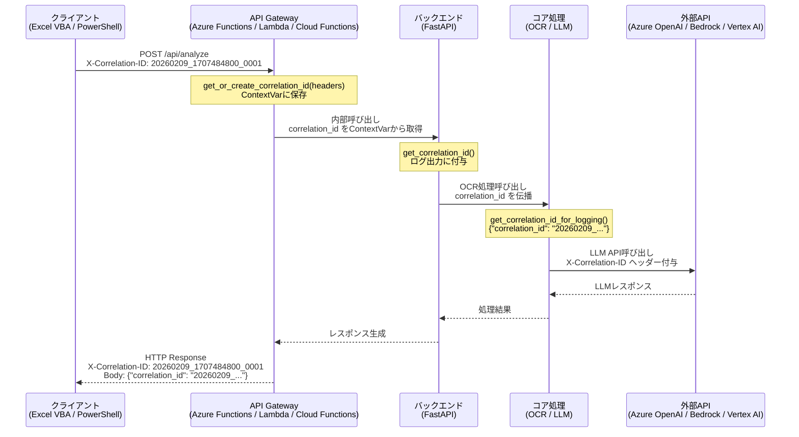
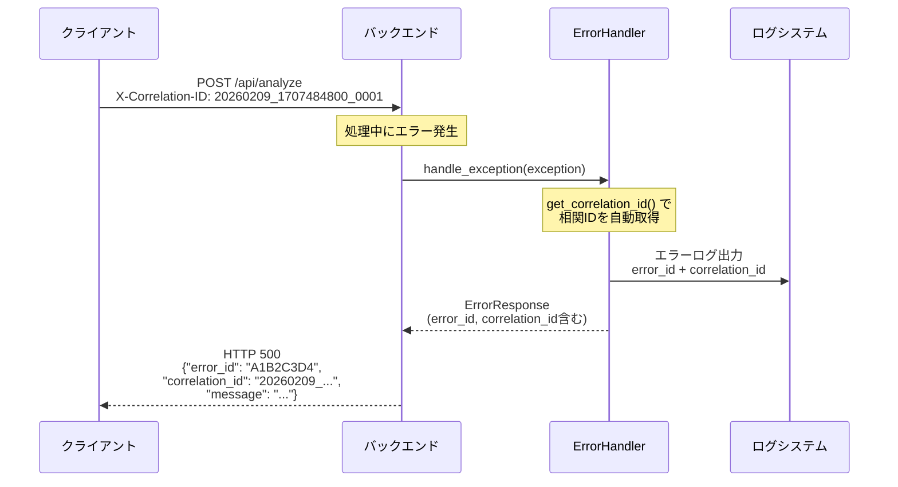

# 相関ID（Correlation ID）設計・運用ガイド

> **対象システム**: 内部統制テストAIエージェント (ic-test-ai-agent)
> **最終更新**: 2026-02-11
> **モジュール**: `src/core/correlation.py`

---

## 目次

1. [相関ID概要](#1-相関id概要)
2. [相関IDフォーマット](#2-相関idフォーマット)
3. [ContextVar実装詳細](#3-contextvar実装詳細)
4. [伝播フロー図](#4-伝播フロー図)
5. [API関数リファレンス](#5-api関数リファレンス)
6. [クライアント実装ガイド](#6-クライアント実装ガイド)
7. [ログ統合](#7-ログ統合)
8. [プラットフォーム別クエリ](#8-プラットフォーム別クエリ)

---

## 1. 相関ID概要

### 目的

相関ID（Correlation ID）は、クライアントからサーバー、外部API（LLM/OCR）に至るまで、
**1つのリクエストを構成するすべての処理をエンドツーエンドで追跡する**ための一意識別子です。

### 解決する課題

| 課題 | 相関IDによる解決 |
|------|-----------------|
| 分散システムでのログ追跡困難 | 全コンポーネントのログを1つのIDで紐付け |
| エラー原因の特定に時間がかかる | 相関IDでリクエスト全体のフローを即座に再現 |
| クライアント問い合わせ対応 | クライアントが保持するIDでサーバー側ログを検索 |
| パフォーマンスボトルネック分析 | 各処理段階の所要時間を1リクエスト単位で可視化 |

### 基本的な仕組み

1. **クライアント**がリクエスト時に `X-Correlation-ID` ヘッダーを設定
2. **APIゲートウェイ/バックエンド**がヘッダーから相関IDを抽出し、ContextVarに保存
3. ヘッダーが存在しない場合は**UUIDを自動生成**
4. 以降の全処理（OCR、LLM呼び出し、ログ出力）で相関IDを伝播
5. レスポンスにも相関IDを含めてクライアントに返却

---

## 2. 相関IDフォーマット

本システムでは2種類の相関IDフォーマットを使用します。

### クライアント生成フォーマット

```
YYYYMMDD_UNIXTIME_NNNN
```

| セグメント | 説明 | 例 |
|-----------|------|-----|
| `YYYYMMDD` | 処理日（年月日） | `20260209` |
| `UNIXTIME` | UNIXタイムスタンプ（秒） | `1707484800` |
| `NNNN` | 連番（4桁ゼロ埋め） | `0001` |

**完全な例**: `20260209_1707484800_0001`

このフォーマットの利点:
- **日付による検索が容易**: プレフィックス `20260209_` で日次フィルタリング可能
- **時系列ソートが自然**: UNIXタイムスタンプにより生成順序が保証される
- **連番で重複防止**: 同一秒内の複数リクエストを区別
- **人間可読**: タイムスタンプから大まかな処理時刻を推測可能

### サーバー生成フォーマット（フォールバック）

クライアントが `X-Correlation-ID` ヘッダーを設定しなかった場合、サーバー側で
UUID v4 を自動生成します。

```
xxxxxxxx-xxxx-4xxx-yxxx-xxxxxxxxxxxx
```

**例**: `a3b8f7e2-1c4d-4e9a-b5f6-7d8e9f0a1b2c`

### フォーマット判別

```python
import re

def is_client_generated(correlation_id: str) -> bool:
    """クライアント生成フォーマットか判別"""
    pattern = r'^\d{8}_\d{10}_\d{4}$'
    return bool(re.match(pattern, correlation_id))

def is_server_generated(correlation_id: str) -> bool:
    """サーバー生成（UUID）フォーマットか判別"""
    pattern = r'^[0-9a-f]{8}-[0-9a-f]{4}-4[0-9a-f]{3}-[89ab][0-9a-f]{3}-[0-9a-f]{12}$'
    return bool(re.match(pattern, correlation_id, re.IGNORECASE))
```

---

## 3. ContextVar実装詳細

### Python ContextVarの特性

`contextvars.ContextVar` は Python 3.7 で導入された、コンテキスト固有の変数を管理する仕組みです。

```python
from contextvars import ContextVar
from typing import Optional

# 相関IDを保持するContextVar（スレッドセーフ）
correlation_id_var: ContextVar[Optional[str]] = ContextVar(
    'correlation_id',
    default=None
)
```

### スレッドセーフ性

| 実行モデル | 安全性 | 説明 |
|-----------|--------|------|
| マルチスレッド | 安全 | 各スレッドが独立したコンテキストを保持 |
| asyncio | 安全 | 各Taskが独立したコンテキストのコピーを保持 |
| マルチプロセス | 安全 | プロセスごとに完全に独立 |

### ContextVarのライフサイクル

```
リクエスト受信
    │
    ▼
get_or_create_correlation_id(headers)  ← ContextVarに設定
    │
    ▼
[処理A] get_correlation_id()           ← 同一コンテキスト内で取得
    │
    ▼
[処理B] get_correlation_id()           ← 同一コンテキスト内で取得
    │
    ▼
[ログ出力] get_correlation_id_for_logging()
    │
    ▼
clear_correlation_id()                 ← リクエスト完了後にクリア
```

### asyncioにおける動作

```python
import asyncio
from src.core.correlation import set_correlation_id, get_correlation_id

async def process_request_a():
    set_correlation_id("request-a-id")
    await asyncio.sleep(1)
    # "request-a-id" が返る（request-b-idではない）
    assert get_correlation_id() == "request-a-id"

async def process_request_b():
    set_correlation_id("request-b-id")
    await asyncio.sleep(1)
    # "request-b-id" が返る（request-a-idではない）
    assert get_correlation_id() == "request-b-id"

async def main():
    # 並行実行しても相関IDが混在しない
    await asyncio.gather(
        process_request_a(),
        process_request_b()
    )
```

---

## 4. 伝播フロー図

### リクエスト全体の相関ID伝播



### エラー発生時の伝播



---

## 5. API関数リファレンス

### 5.1 get_or_create_correlation_id

HTTPヘッダーから相関IDを取得し、存在しない場合はUUIDを自動生成します。

```python
def get_or_create_correlation_id(headers: Dict[str, str]) -> str
```

| パラメータ | 型 | 説明 |
|-----------|-----|------|
| `headers` | `Dict[str, str]` | HTTPリクエストヘッダー辞書 |

| 戻り値 | 型 | 説明 |
|--------|-----|------|
| 相関ID | `str` | 取得または生成された相関ID |

**動作詳細**:
- ヘッダーキー `X-Correlation-ID` を**大文字小文字を区別せず**検索
- 見つかった場合はその値を使用し、ContextVarに設定
- 見つからない場合はUUID v4を生成し、ContextVarに設定
- 生成時はINFOレベルでログ出力

```python
# ヘッダーに相関IDがある場合
headers = {"X-Correlation-ID": "20260209_1707484800_0001"}
cid = get_or_create_correlation_id(headers)
# => "20260209_1707484800_0001"

# 大文字小文字を区別しない
headers = {"x-correlation-id": "20260209_1707484800_0002"}
cid = get_or_create_correlation_id(headers)
# => "20260209_1707484800_0002"

# ヘッダーがない場合はUUID生成
cid = get_or_create_correlation_id({})
# => "a3b8f7e2-1c4d-4e9a-b5f6-7d8e9f0a1b2c"
```

### 5.2 get_correlation_id

現在のコンテキストに設定されている相関IDを取得します。

```python
def get_correlation_id() -> Optional[str]
```

| 戻り値 | 型 | 説明 |
|--------|-----|------|
| 相関ID | `Optional[str]` | 設定されていない場合は `None` |

```python
set_correlation_id("test-correlation-id")
cid = get_correlation_id()
# => "test-correlation-id"

clear_correlation_id()
cid = get_correlation_id()
# => None
```

### 5.3 set_correlation_id

相関IDを明示的に設定します。

```python
def set_correlation_id(correlation_id: str) -> None
```

| パラメータ | 型 | 説明 |
|-----------|-----|------|
| `correlation_id` | `str` | 設定する相関ID |

```python
set_correlation_id("custom-correlation-id")
print(get_correlation_id())
# => "custom-correlation-id"
```

**注意**: DEBUGレベルでログ出力されます。

### 5.4 clear_correlation_id

相関IDをクリアします。リクエスト完了後のクリーンアップやテスト時に使用します。

```python
def clear_correlation_id() -> None
```

```python
set_correlation_id("test-id")
clear_correlation_id()
print(get_correlation_id())
# => None
```

### 5.5 extract_correlation_id_from_dict

辞書データから相関IDを抽出します。メッセージキューやイベントデータからの取得に使用します。

```python
def extract_correlation_id_from_dict(
    data: Dict,
    key: str = "correlation_id"
) -> Optional[str]
```

| パラメータ | 型 | デフォルト | 説明 |
|-----------|-----|----------|------|
| `data` | `Dict` | - | 辞書データ |
| `key` | `str` | `"correlation_id"` | 相関IDのキー名 |

| 戻り値 | 型 | 説明 |
|--------|-----|------|
| 相関ID | `Optional[str]` | 見つからない場合は `None` |

```python
data = {"correlation_id": "test-id", "payload": "..."}
cid = extract_correlation_id_from_dict(data)
# => "test-id"

# カスタムキー名
data = {"request_id": "custom-id"}
cid = extract_correlation_id_from_dict(data, key="request_id")
# => "custom-id"
```

### 5.6 inject_correlation_id_into_dict

辞書に現在の相関IDを注入します。外部API呼び出し時のペイロード構築に使用します。

```python
def inject_correlation_id_into_dict(
    data: Dict,
    key: str = "correlation_id"
) -> Dict
```

| パラメータ | 型 | デフォルト | 説明 |
|-----------|-----|----------|------|
| `data` | `Dict` | - | 辞書データ |
| `key` | `str` | `"correlation_id"` | 相関IDのキー名 |

| 戻り値 | 型 | 説明 |
|--------|-----|------|
| 新しい辞書 | `Dict` | 相関IDが追加された辞書のコピー |

**注意**: 元の辞書は変更されません（イミュータブル操作）。相関IDが未設定の場合は元の辞書がそのまま返されます。

```python
set_correlation_id("test-id")
data = {"message": "hello"}
result = inject_correlation_id_into_dict(data)
# => {"message": "hello", "correlation_id": "test-id"}

# 元の辞書は変更されない
print(data)
# => {"message": "hello"}
```

### 5.7 get_correlation_id_for_logging

ログ出力用の相関ID辞書を取得します。Pythonの `logging` モジュールの `extra` パラメータに直接渡せる形式です。

```python
def get_correlation_id_for_logging() -> Dict[str, str]
```

| 戻り値 | 型 | 説明 |
|--------|-----|------|
| ログ用辞書 | `Dict[str, str]` | `{"correlation_id": "xxx"}` 形式。未設定時は空辞書 `{}` |

```python
import logging
logger = logging.getLogger(__name__)

set_correlation_id("20260209_1707484800_0001")

# ログ出力時にextraパラメータとして使用
logger.info(
    "ドキュメント処理開始",
    extra=get_correlation_id_for_logging()
)
# => INFO ドキュメント処理開始 [correlation_id=20260209_1707484800_0001]
```

---

## 6. クライアント実装ガイド

### 6.1 Excel VBA での実装

```vba
'=============================================================================
' 相関ID生成・設定モジュール
'=============================================================================

' 連番カウンター（モジュールレベル変数）
Private mSequenceNumber As Long

'---------------------------------------------------------------------
' 相関IDの生成
' 形式: YYYYMMDD_UNIXTIME_NNNN
'---------------------------------------------------------------------
Public Function GenerateCorrelationId() As String
    Dim datePart As String
    Dim unixTime As Long
    Dim seqPart As String

    ' 日付部分（YYYYMMDD）
    datePart = Format(Now, "yyyymmdd")

    ' UNIXタイムスタンプ（秒）
    unixTime = DateDiff("s", #1/1/1970#, Now)

    ' 連番（4桁ゼロ埋め）
    mSequenceNumber = mSequenceNumber + 1
    If mSequenceNumber > 9999 Then mSequenceNumber = 1
    seqPart = Format(mSequenceNumber, "0000")

    GenerateCorrelationId = datePart & "_" & CStr(unixTime) & "_" & seqPart
End Function

'---------------------------------------------------------------------
' APIリクエスト送信（相関ID付き）
'---------------------------------------------------------------------
Public Function SendAnalyzeRequest( _
    ByVal apiUrl As String, _
    ByVal requestBody As String _
) As String
    Dim http As Object
    Dim correlationId As String

    Set http = CreateObject("MSXML2.XMLHTTP")
    correlationId = GenerateCorrelationId()

    ' HTTPリクエスト構築
    http.Open "POST", apiUrl, False
    http.setRequestHeader "Content-Type", "application/json"
    http.setRequestHeader "X-Correlation-ID", correlationId

    ' リクエスト送信
    http.Send requestBody

    ' 相関IDをログシートに記録
    LogCorrelationId correlationId, http.Status, http.responseText

    SendAnalyzeRequest = http.responseText
End Function

'---------------------------------------------------------------------
' 相関IDのログ記録（Excelシートに出力）
'---------------------------------------------------------------------
Private Sub LogCorrelationId( _
    ByVal correlationId As String, _
    ByVal statusCode As Long, _
    ByVal response As String _
)
    Dim ws As Worksheet
    Dim nextRow As Long

    Set ws = ThisWorkbook.Sheets("APIログ")
    nextRow = ws.Cells(ws.Rows.Count, 1).End(xlUp).Row + 1

    ws.Cells(nextRow, 1).Value = Now
    ws.Cells(nextRow, 2).Value = correlationId
    ws.Cells(nextRow, 3).Value = statusCode
    ws.Cells(nextRow, 4).Value = Left(response, 1000)
End Sub
```

### 6.2 PowerShell での実装

```powershell
#=============================================================================
# 相関ID生成・設定モジュール
#=============================================================================

# モジュールレベル連番カウンター
$script:SequenceNumber = 0

function New-CorrelationId {
    <#
    .SYNOPSIS
        相関IDを生成（YYYYMMDD_UNIXTIME_NNNN形式）
    #>
    $datePart = Get-Date -Format "yyyyMMdd"
    $unixTime = [int][double]::Parse(
        (Get-Date -UFormat %s)
    )
    $script:SequenceNumber++
    if ($script:SequenceNumber -gt 9999) { $script:SequenceNumber = 1 }
    $seqPart = $script:SequenceNumber.ToString("D4")

    return "${datePart}_${unixTime}_${seqPart}"
}

function Invoke-AnalyzeRequest {
    <#
    .SYNOPSIS
        内部統制テスト分析リクエストを送信（相関ID付き）
    .PARAMETER ApiUrl
        APIエンドポイントURL
    .PARAMETER Body
        リクエストボディ（ハッシュテーブル）
    #>
    param(
        [Parameter(Mandatory)]
        [string]$ApiUrl,

        [Parameter(Mandatory)]
        [hashtable]$Body
    )

    $correlationId = New-CorrelationId

    $headers = @{
        "Content-Type"     = "application/json"
        "X-Correlation-ID" = $correlationId
    }

    $jsonBody = $Body | ConvertTo-Json -Depth 10

    try {
        $response = Invoke-RestMethod `
            -Uri $ApiUrl `
            -Method Post `
            -Headers $headers `
            -Body $jsonBody `
            -ErrorAction Stop

        Write-Host "[OK] Correlation ID: $correlationId"
        return $response
    }
    catch {
        Write-Error "[ERROR] Correlation ID: $correlationId - $_"
        throw
    }
}

# 使用例
# $result = Invoke-AnalyzeRequest `
#     -ApiUrl "https://api.example.com/api/analyze" `
#     -Body @{
#         document_path = "C:\Documents\test.pdf"
#         test_type     = "SOX_CONTROL"
#     }
```

---

## 7. ログ統合

### ログフォーマット設定

相関IDをすべてのログ出力に含めるためのフォーマッター設定です。

```python
import logging
from src.core.correlation import get_correlation_id_for_logging

# カスタムフォーマッター
class CorrelationIdFilter(logging.Filter):
    """ログレコードに相関IDを自動追加するフィルター"""

    def filter(self, record):
        from src.core.correlation import get_correlation_id
        record.correlation_id = get_correlation_id() or "N/A"
        return True

# ロガー設定
handler = logging.StreamHandler()
handler.addFilter(CorrelationIdFilter())
formatter = logging.Formatter(
    '%(asctime)s [%(levelname)s] [cid=%(correlation_id)s] '
    '%(name)s: %(message)s'
)
handler.setFormatter(formatter)

logger = logging.getLogger()
logger.addHandler(handler)
```

### ログ出力例

```
2026-02-09 10:15:30,123 [INFO] [cid=20260209_1707484800_0001] src.core.processor: ドキュメント処理開始
2026-02-09 10:15:31,456 [INFO] [cid=20260209_1707484800_0001] src.core.ocr: OCR処理完了 (1.3s)
2026-02-09 10:15:35,789 [INFO] [cid=20260209_1707484800_0001] src.core.llm: LLM分析完了 (4.3s)
2026-02-09 10:15:36,012 [INFO] [cid=20260209_1707484800_0001] src.core.processor: ドキュメント処理完了
```

### get_correlation_id_for_logging() の使用パターン

```python
# パターン1: extra パラメータとして直接渡す
logger.info("処理開始", extra=get_correlation_id_for_logging())

# パターン2: 他のextraデータと結合
extra_data = {
    "document_id": doc_id,
    "page_count": 5,
    **get_correlation_id_for_logging()
}
logger.info("OCR処理開始", extra=extra_data)

# パターン3: 条件付きログ出力
cid_extra = get_correlation_id_for_logging()
if cid_extra:
    logger.info("相関ID付きログ", extra=cid_extra)
else:
    logger.info("相関IDなしログ")
```

---

## 8. プラットフォーム別クエリ

### 8.1 Azure Application Insights（Kusto Query Language）

```kusto
// 特定の相関IDに関連するすべてのログを時系列で表示
traces
| where customDimensions.correlation_id == "20260209_1707484800_0001"
| order by timestamp asc
| project timestamp, message, severityLevel,
    customDimensions.correlation_id,
    customDimensions.error_id

// 特定日のすべてのクライアント生成相関IDを一覧表示
traces
| where customDimensions.correlation_id startswith "20260209_"
| summarize
    request_count = count(),
    first_seen = min(timestamp),
    last_seen = max(timestamp),
    errors = countif(severityLevel >= 3)
    by tostring(customDimensions.correlation_id)
| order by first_seen desc

// サーバー生成ID（UUID）の割合を確認
traces
| where isnotempty(customDimensions.correlation_id)
| extend is_client_generated = customDimensions.correlation_id matches regex @"^\d{8}_\d{10}_\d{4}$"
| summarize
    client_generated = countif(is_client_generated),
    server_generated = countif(not(is_client_generated)),
    total = count()
    by bin(timestamp, 1h)
```

### 8.2 AWS CloudWatch Insights

```
# 特定の相関IDでログを検索
fields @timestamp, @message, correlation_id
| filter correlation_id = "20260209_1707484800_0001"
| sort @timestamp asc

# 特定日のリクエスト概要
fields @timestamp, correlation_id, @message
| filter correlation_id like /^20260209_/
| stats count() as request_count,
    earliest(@timestamp) as first_seen,
    latest(@timestamp) as last_seen
    by correlation_id
| sort first_seen desc

# サーバー生成IDの検出
fields @timestamp, correlation_id
| filter correlation_id like /^[0-9a-f]{8}-/
| stats count() as uuid_count by bin(@timestamp, 1h)
```

### 8.3 GCP Cloud Logging

```
# 特定の相関IDでフィルタ
resource.type="cloud_function"
jsonPayload.correlation_id="20260209_1707484800_0001"

# 特定日のリクエスト一覧（Cloud Logging フィルタ構文）
resource.type="cloud_function"
jsonPayload.correlation_id=~"^20260209_"
severity>=INFO

# BigQueryエクスポート後のSQL分析
SELECT
    JSON_VALUE(json_payload, '$.correlation_id') AS correlation_id,
    MIN(timestamp) AS first_seen,
    MAX(timestamp) AS last_seen,
    COUNT(*) AS log_count,
    COUNTIF(severity = 'ERROR') AS error_count
FROM
    `project.dataset.cloud_function_logs`
WHERE
    DATE(timestamp) = '2026-02-09'
    AND JSON_VALUE(json_payload, '$.correlation_id') IS NOT NULL
GROUP BY
    correlation_id
ORDER BY
    first_seen DESC
```

---

## 付録: トラブルシューティング

### よくある問題

| 症状 | 原因 | 対処法 |
|------|------|--------|
| 相関IDが常にUUID | クライアントがヘッダー未設定 | `X-Correlation-ID` ヘッダーの設定を確認 |
| 相関IDが `None` | ContextVarが未初期化 | `get_or_create_correlation_id()` がリクエスト冒頭で呼ばれているか確認 |
| 非同期タスクで相関IDが消える | タスク作成時にコンテキスト未コピー | `asyncio.create_task()` の前に `contextvars.copy_context()` を使用 |
| ログに相関IDが表示されない | ログフォーマッターの設定不足 | `CorrelationIdFilter` の設定を確認 |

### asyncioでのコンテキスト伝播

```python
import asyncio
import contextvars

async def background_task():
    # 親タスクの相関IDが自動的に引き継がれる
    cid = get_correlation_id()
    logger.info(f"バックグラウンドタスク開始: {cid}")

async def main_handler(headers):
    get_or_create_correlation_id(headers)

    # asyncio.create_task() はコンテキストを自動コピー
    task = asyncio.create_task(background_task())
    await task
```
