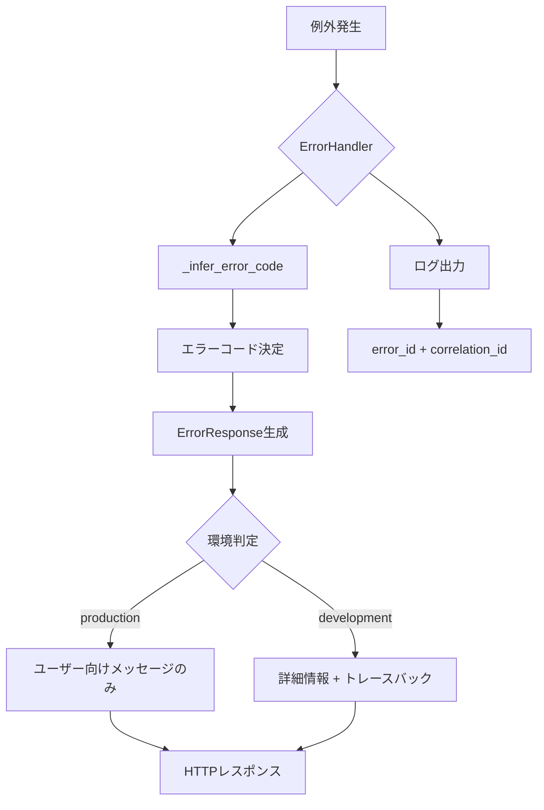
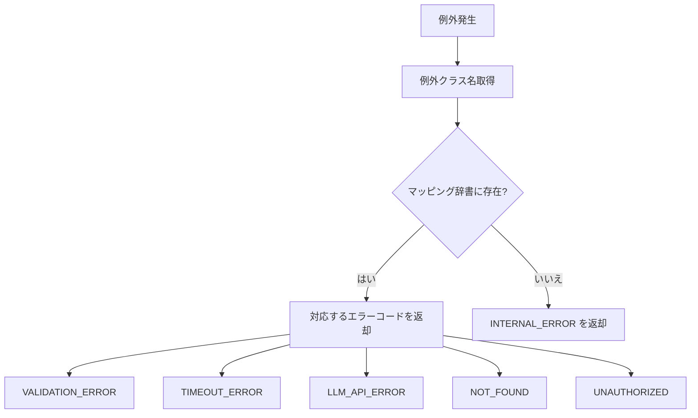
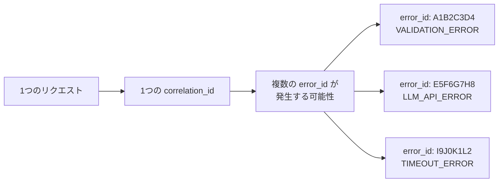

# エラーハンドリング設計ドキュメント

> **対象システム**: 内部統制テストAIエージェント (ic-test-ai-agent)
> **最終更新**: 2026-02-11
> **モジュール**: `src/core/error_handler.py`

---

## 目次

1. [エラーハンドリング概要](#1-エラーハンドリング概要)
2. [ErrorResponseデータクラス](#2-errorresponseデータクラス)
3. [ErrorHandlerクラス](#3-errorhandlerクラス)
4. [エラーコード一覧](#4-エラーコード一覧)
5. [例外からエラーコードへの自動マッピング](#5-例外からエラーコードへの自動マッピング)
6. [環境別レスポンス比較](#6-環境別レスポンス比較)
7. [使用例](#7-使用例)
8. [ログ統合](#8-ログ統合)
9. [HTTPレスポンス形式](#9-httpレスポンス形式)

---

## 1. エラーハンドリング概要

### 設計思想

本システムのエラーハンドリングは、**本番環境と開発環境で異なるレスポンスを返す**ことを
基本方針としています。

| 環境 | レスポンス内容 | 目的 |
|------|-------------|------|
| **本番環境** (`production`) | ユーザー向けメッセージのみ | セキュリティ（内部情報漏洩防止） |
| **開発環境** (`development`) | トレースバック含む詳細情報 | デバッグ効率の最大化 |

### アーキテクチャ



### 主要コンポーネント

| コンポーネント | 役割 |
|--------------|------|
| `ErrorResponse` | エラー情報を統一的に格納するデータクラス |
| `ErrorHandler` | エラーレスポンス生成とHTTPレスポンス変換 |
| `_infer_error_code` | 例外タイプからエラーコードを自動推測 |
| グローバル関数 | `create_error_response()`, `handle_exception()` |

### 環境判定

環境変数 `ENVIRONMENT` の値により判定されます。

```python
# 本番環境
ENVIRONMENT=production  # → is_production = True

# 開発環境（デフォルト）
ENVIRONMENT=development  # → is_production = False
# 環境変数未設定時も開発環境として扱う
```

---

## 2. ErrorResponseデータクラス

### クラス定義

```python
@dataclass
class ErrorResponse:
    error_id: str           # エラーの一意識別子（ログ追跡用）
    correlation_id: str     # リクエストの相関ID
    error_code: str         # エラーコード
    message: str            # 内部用詳細エラーメッセージ
    user_message: str       # ユーザー向けメッセージ
    timestamp: str          # エラー発生時刻（ISO 8601形式）
    trace: Optional[str]    # トレースバック情報（開発環境のみ）
```

### フィールド詳細

| フィールド | 型 | デフォルト | 説明 |
|-----------|-----|----------|------|
| `error_id` | `str` | - | UUID v4の先頭8文字（大文字）。例: `A1B2C3D4` |
| `correlation_id` | `str` | - | リクエストの相関ID。未設定時は `"unknown"` |
| `error_code` | `str` | - | 定義済みエラーコード |
| `message` | `str` | - | 内部用の詳細メッセージ（例外メッセージ等） |
| `user_message` | `str` | - | エンドユーザーに表示する日本語メッセージ |
| `timestamp` | `str` | `datetime.utcnow().isoformat()` | UTC時刻のISO 8601文字列 |
| `trace` | `Optional[str]` | `None` | Pythonトレースバック文字列 |

### to_dict() メソッド

ErrorResponseを辞書形式に変換します。`include_internal` パラメータにより
返却される情報量が変わります。

```python
def to_dict(self, include_internal: bool = False) -> Dict[str, Any]
```

#### include_internal=False の場合（本番環境）

```python
{
    "error_id": "A1B2C3D4",
    "correlation_id": "20260209_1707484800_0001",
    "error_code": "VALIDATION_ERROR",
    "message": "リクエストの形式が正しくありません。入力内容を確認してください。",
    "timestamp": "2026-02-09T10:15:30.123456"
}
```

**注意**: `message` フィールドには `user_message` の値が設定されます（内部メッセージではない）。

#### include_internal=True の場合（開発環境）

```python
{
    "error_id": "A1B2C3D4",
    "correlation_id": "20260209_1707484800_0001",
    "error_code": "VALIDATION_ERROR",
    "message": "リクエストの形式が正しくありません。入力内容を確認してください。",
    "timestamp": "2026-02-09T10:15:30.123456",
    "internal_message": "ValueError: Missing required field: items",
    "traceback": "Traceback (most recent call last):\n  File ..."
}
```

追加フィールド:
- `internal_message`: 内部用の詳細エラーメッセージ
- `traceback`: Pythonトレースバック（`trace` フィールドが設定されている場合のみ）

---

## 3. ErrorHandlerクラス

### 初期化

```python
class ErrorHandler:
    def __init__(self):
        self.is_production = os.getenv("ENVIRONMENT", "development").lower() == "production"
```

### create_error_response

エラーコードと内部メッセージからErrorResponseを生成します。

```python
def create_error_response(
    self,
    error_code: str,
    internal_message: str,
    user_message: Optional[str] = None,
    exception: Optional[Exception] = None
) -> ErrorResponse
```

| パラメータ | 型 | 必須 | 説明 |
|-----------|-----|------|------|
| `error_code` | `str` | はい | 定義済みエラーコード |
| `internal_message` | `str` | はい | 内部用詳細メッセージ |
| `user_message` | `Optional[str]` | いいえ | ユーザー向けメッセージ（Noneでデフォルト使用） |
| `exception` | `Optional[Exception]` | いいえ | 例外オブジェクト（トレースバック取得用） |

**動作詳細**:
1. UUID v4の先頭8文字を `error_id` として生成
2. `get_correlation_id()` で現在の相関IDを取得（未設定時は `"unknown"`）
3. `user_message` が `None` の場合、`ERROR_MESSAGES` 辞書からデフォルトメッセージを取得
4. 開発環境かつ `exception` が渡された場合、トレースバックを取得
5. ERRORレベルでログ出力（error_id、correlation_id、error_code付き）
6. `ErrorResponse` オブジェクトを返却

### handle_exception

例外オブジェクトからErrorResponseを自動生成します。

```python
def handle_exception(
    self,
    exception: Exception,
    error_code: Optional[str] = None,
    user_message: Optional[str] = None
) -> ErrorResponse
```

| パラメータ | 型 | 必須 | 説明 |
|-----------|-----|------|------|
| `exception` | `Exception` | はい | 例外オブジェクト |
| `error_code` | `Optional[str]` | いいえ | エラーコード（Noneで自動推測） |
| `user_message` | `Optional[str]` | いいえ | ユーザー向けメッセージ |

**動作詳細**:
1. `error_code` が `None` の場合、`_infer_error_code()` で例外タイプから推測
2. `internal_message` を `"{例外クラス名}: {例外メッセージ}"` の形式で構築
3. `create_error_response()` に委譲

### _infer_error_code

例外タイプからエラーコードを推測する内部メソッドです。

```python
def _infer_error_code(self, exception: Exception) -> str
```

マッピングテーブルは[セクション5](#5-例外からエラーコードへの自動マッピング)を参照してください。

### to_http_response

ErrorResponseをHTTPレスポンス形式のタプルに変換します。

```python
def to_http_response(
    self,
    error_response: ErrorResponse,
    status_code: int = 500
) -> tuple[Dict[str, Any], int]
```

| パラメータ | 型 | デフォルト | 説明 |
|-----------|-----|----------|------|
| `error_response` | `ErrorResponse` | - | ErrorResponseオブジェクト |
| `status_code` | `int` | `500` | HTTPステータスコード |

**戻り値**: `(レスポンスボディ辞書, ステータスコード)` のタプル

**環境別動作**:
- **本番環境**: `to_dict(include_internal=False)` を使用
- **開発環境**: `to_dict(include_internal=True)` を使用（内部情報含む）

### グローバル関数

モジュールレベルで `_global_handler = ErrorHandler()` のインスタンスが作成されており、
以下のショートカット関数が提供されます。

```python
# グローバルハンドラー経由のショートカット
from src.core.error_handler import create_error_response, handle_exception

error = create_error_response("VALIDATION_ERROR", "Missing field")
error = handle_exception(ValueError("Invalid input"))
```

---

## 4. エラーコード一覧

| エラーコード | HTTPステータス | ユーザー向けメッセージ | 典型的な原因 | 対処法 |
|-------------|-------------|---------------------|------------|--------|
| `VALIDATION_ERROR` | 400 | リクエストの形式が正しくありません。入力内容を確認してください。 | 入力パラメータ不正、必須フィールド欠落 | リクエストJSONの形式を確認 |
| `LLM_API_ERROR` | 502 | AI処理でエラーが発生しました。しばらく待ってから再試行してください。 | LLM API接続障害、レート制限、モデルエラー | 待機後に再試行、API状態確認 |
| `OCR_ERROR` | 422 | 文字認識処理でエラーが発生しました。画像ファイルを確認してください。 | 画像品質不良、サポート外形式、サービス障害 | 画像ファイルの品質・形式確認 |
| `SECRET_ERROR` | 503 | 認証情報の取得に失敗しました。システム管理者に連絡してください。 | Key Vault/Secrets Manager接続障害 | シークレット設定・権限確認 |
| `TIMEOUT_ERROR` | 504 | 処理がタイムアウトしました。処理量を減らすか、後で再試行してください。 | 処理時間超過、外部API無応答 | データ量削減、タイムアウト値調整 |
| `INTERNAL_ERROR` | 500 | 内部エラーが発生しました。システム管理者に連絡してください。 | 予期しないバグ、設定不備 | ログ確認、error_idで調査 |
| `NOT_FOUND` | 404 | 指定されたリソースが見つかりません。 | ファイル不在、エンドポイント不正 | パス・URLの確認 |
| `UNAUTHORIZED` | 401 | 認証に失敗しました。APIキーを確認してください。 | APIキー不正、有効期限切れ | APIキーの再発行・設定確認 |
| `RATE_LIMIT_EXCEEDED` | 429 | リクエスト数の上限を超えました。しばらく待ってから再試行してください。 | API呼び出し頻度超過 | 待機後に再試行、レート制限確認 |

---

## 5. 例外からエラーコードへの自動マッピング

`_infer_error_code()` メソッドは、Python例外のクラス名に基づいて
エラーコードを自動的に推測します。

### マッピングテーブル

| 例外クラス名 | マッピング先エラーコード | 説明 |
|-------------|---------------------|------|
| `ValueError` | `VALIDATION_ERROR` | 値の検証エラー |
| `KeyError` | `VALIDATION_ERROR` | キー不在（必須フィールド欠落） |
| `ValidationError` | `VALIDATION_ERROR` | Pydantic等のバリデーションエラー |
| `TimeoutError` | `TIMEOUT_ERROR` | タイムアウト |
| `ConnectionError` | `LLM_API_ERROR` | 接続エラー（API通信障害） |
| `HTTPError` | `LLM_API_ERROR` | HTTP通信エラー |
| `FileNotFoundError` | `NOT_FOUND` | ファイル不在 |
| `PermissionError` | `UNAUTHORIZED` | 権限不足 |
| **その他すべて** | `INTERNAL_ERROR` | 未分類の例外 |

### マッピングフロー



### 明示的指定との優先順位

`handle_exception()` に `error_code` を明示的に渡した場合、自動推測は行われません。

```python
handler = ErrorHandler()

# 自動推測: ValueError → VALIDATION_ERROR
error = handler.handle_exception(ValueError("bad input"))
# error.error_code == "VALIDATION_ERROR"

# 明示的指定: ValueError でも LLM_API_ERROR として扱う
error = handler.handle_exception(
    ValueError("bad input"),
    error_code="LLM_API_ERROR"
)
# error.error_code == "LLM_API_ERROR"
```

---

## 6. 環境別レスポンス比較

### 同一エラーの環境別出力比較

以下のコードで `ValueError` が発生した場合の出力を比較します。

```python
handler = ErrorHandler()
try:
    raise ValueError("Required field 'items' is missing")
except ValueError as e:
    error = handler.handle_exception(e)
    body, status = handler.to_http_response(error, status_code=400)
```

### 開発環境（ENVIRONMENT=development）

```json
{
    "error_id": "A1B2C3D4",
    "correlation_id": "20260209_1707484800_0001",
    "error_code": "VALIDATION_ERROR",
    "message": "リクエストの形式が正しくありません。入力内容を確認してください。",
    "timestamp": "2026-02-09T10:15:30.123456",
    "internal_message": "ValueError: Required field 'items' is missing",
    "traceback": "Traceback (most recent call last):\n  File \"/app/src/core/processor.py\", line 42, in process\n    validate_input(data)\n  File \"/app/src/core/validator.py\", line 18, in validate_input\n    raise ValueError(\"Required field 'items' is missing\")\nValueError: Required field 'items' is missing\n"
}
```

### 本番環境（ENVIRONMENT=production）

```json
{
    "error_id": "A1B2C3D4",
    "correlation_id": "20260209_1707484800_0001",
    "error_code": "VALIDATION_ERROR",
    "message": "リクエストの形式が正しくありません。入力内容を確認してください。",
    "timestamp": "2026-02-09T10:15:30.123456"
}
```

### 差分まとめ

| フィールド | 開発環境 | 本番環境 |
|-----------|--------|--------|
| `error_id` | 含まれる | 含まれる |
| `correlation_id` | 含まれる | 含まれる |
| `error_code` | 含まれる | 含まれる |
| `message` | user_messageの値 | user_messageの値 |
| `timestamp` | 含まれる | 含まれる |
| `internal_message` | **含まれる**（詳細メッセージ） | 含まれない |
| `traceback` | **含まれる**（完全なスタックトレース） | 含まれない |

### セキュリティ上の考慮事項

本番環境で `internal_message` と `traceback` を隠蔽する理由:

1. **ファイルパスの漏洩防止**: トレースバックにはサーバー内部のファイルパスが含まれる
2. **依存ライブラリ情報の秘匿**: スタックトレースから使用ライブラリとバージョンが推測可能
3. **ビジネスロジックの保護**: 内部メッセージからバリデーションルールが推測される
4. **攻撃ベクトルの最小化**: 詳細なエラー情報は攻撃者にとって有用な情報源

---

## 7. 使用例

### 7.1 基本的なエラーハンドリング

```python
from src.core.error_handler import ErrorHandler

handler = ErrorHandler()

# パターン1: 明示的なエラーレスポンス作成
error = handler.create_error_response(
    error_code="VALIDATION_ERROR",
    internal_message="Missing required field: items",
    user_message=None  # デフォルトメッセージ使用
)
body, status = handler.to_http_response(error, status_code=400)
# status == 400

# パターン2: 例外からの自動生成
try:
    result = process_document(data)
except ValueError as e:
    error = handler.handle_exception(e)
    body, status = handler.to_http_response(error, status_code=400)
```

### 7.2 グローバル関数の使用

```python
from src.core.error_handler import create_error_response, handle_exception

# モジュールレベルのショートカット関数
error = create_error_response(
    error_code="OCR_ERROR",
    internal_message="Document Intelligence returned empty result"
)

# 例外処理
try:
    result = call_llm_api(prompt)
except ConnectionError as e:
    error = handle_exception(e)
    # error.error_code == "LLM_API_ERROR" (自動推測)
```

### 7.3 FastAPIでの統合

```python
from fastapi import FastAPI, Request
from fastapi.responses import JSONResponse
from src.core.correlation import get_or_create_correlation_id
from src.core.error_handler import ErrorHandler

app = FastAPI()
handler = ErrorHandler()

@app.middleware("http")
async def correlation_middleware(request: Request, call_next):
    """相関IDミドルウェア"""
    headers = dict(request.headers)
    get_or_create_correlation_id(headers)

    try:
        response = await call_next(request)
        return response
    except Exception as e:
        error = handler.handle_exception(e)
        body, status = handler.to_http_response(error)
        return JSONResponse(content=body, status_code=status)

@app.post("/api/analyze")
async def analyze_document(request: Request):
    try:
        data = await request.json()
        result = process_document(data)
        return result

    except ValueError as e:
        error = handler.handle_exception(e, error_code="VALIDATION_ERROR")
        body, status = handler.to_http_response(error, status_code=400)
        return JSONResponse(content=body, status_code=status)

    except TimeoutError as e:
        error = handler.handle_exception(e)
        body, status = handler.to_http_response(error, status_code=504)
        return JSONResponse(content=body, status_code=status)
```

### 7.4 Azure Functionsでの統合

```python
import azure.functions as func
from src.core.correlation import get_or_create_correlation_id
from src.core.error_handler import ErrorHandler

handler = ErrorHandler()

def main(req: func.HttpRequest) -> func.HttpResponse:
    # 相関ID設定
    headers = dict(req.headers)
    correlation_id = get_or_create_correlation_id(headers)

    try:
        # メイン処理
        result = process_request(req)
        return func.HttpResponse(
            body=json.dumps(result),
            status_code=200,
            mimetype="application/json",
            headers={"X-Correlation-ID": correlation_id}
        )

    except Exception as e:
        error = handler.handle_exception(e)
        body, status = handler.to_http_response(error)
        return func.HttpResponse(
            body=json.dumps(body),
            status_code=status,
            mimetype="application/json",
            headers={"X-Correlation-ID": correlation_id}
        )
```

### 7.5 カスタムユーザーメッセージ

```python
handler = ErrorHandler()

# デフォルトメッセージを使用
error = handler.create_error_response(
    error_code="VALIDATION_ERROR",
    internal_message="Field 'test_type' must be one of: SOX_CONTROL, J_SOX"
)
# user_message == "リクエストの形式が正しくありません。入力内容を確認してください。"

# カスタムメッセージを指定
error = handler.create_error_response(
    error_code="VALIDATION_ERROR",
    internal_message="Field 'test_type' must be one of: SOX_CONTROL, J_SOX",
    user_message="テスト種別は SOX_CONTROL または J_SOX を指定してください。"
)
# user_message == "テスト種別は SOX_CONTROL または J_SOX を指定してください。"
```

---

## 8. ログ統合

### エラーログ出力形式

`create_error_response()` 内で自動的にERRORレベルのログが出力されます。

```python
logger.error(
    f"エラー発生 [ID: {error_id}] [{error_code}]: {internal_message}",
    extra={
        "error_id": error_id,
        "correlation_id": correlation_id,
        "error_code": error_code
    },
    exc_info=exception if not self.is_production else None
)
```

### ログ出力例

#### 開発環境

```
2026-02-09 10:15:30,123 [ERROR] src.core.error_handler:
エラー発生 [ID: A1B2C3D4] [VALIDATION_ERROR]: ValueError: Required field 'items' is missing
Traceback (most recent call last):
  File "/app/src/core/processor.py", line 42, in process
    validate_input(data)
  File "/app/src/core/validator.py", line 18, in validate_input
    raise ValueError("Required field 'items' is missing")
ValueError: Required field 'items' is missing
```

#### 本番環境

```
2026-02-09 10:15:30,123 [ERROR] src.core.error_handler:
エラー発生 [ID: A1B2C3D4] [VALIDATION_ERROR]: ValueError: Required field 'items' is missing
```

**差分**: 本番環境では `exc_info=None` のため、トレースバックがログに出力されません。
ただし、内部メッセージ自体はログに記録されるため、`error_id` でログを検索すれば
詳細な原因を特定できます。

### error_idによるログ検索

ユーザーから報告された `error_id` を使用して、ログを検索できます。

```kusto
// Azure Application Insights
traces
| where customDimensions.error_id == "A1B2C3D4"
| project timestamp, message, customDimensions
```

```
// AWS CloudWatch Insights
fields @timestamp, @message, error_id, correlation_id
| filter error_id = "A1B2C3D4"
```

```
// GCP Cloud Logging
resource.type="cloud_function"
jsonPayload.error_id="A1B2C3D4"
```

### 相関IDとerror_idの関係



- **correlation_id**: リクエスト単位の識別子（1リクエスト = 1 correlation_id）
- **error_id**: エラー単位の識別子（1リクエスト中に複数エラーが発生しうる）

---

## 9. HTTPレスポンス形式

### 正常レスポンス

```
HTTP/1.1 200 OK
Content-Type: application/json
X-Correlation-ID: 20260209_1707484800_0001

{
    "status": "success",
    "correlation_id": "20260209_1707484800_0001",
    "result": { ... }
}
```

### エラーレスポンス（本番環境）

```
HTTP/1.1 400 Bad Request
Content-Type: application/json
X-Correlation-ID: 20260209_1707484800_0001

{
    "error_id": "A1B2C3D4",
    "correlation_id": "20260209_1707484800_0001",
    "error_code": "VALIDATION_ERROR",
    "message": "リクエストの形式が正しくありません。入力内容を確認してください。",
    "timestamp": "2026-02-09T10:15:30.123456"
}
```

### エラーレスポンス（開発環境）

```
HTTP/1.1 400 Bad Request
Content-Type: application/json
X-Correlation-ID: 20260209_1707484800_0001

{
    "error_id": "A1B2C3D4",
    "correlation_id": "20260209_1707484800_0001",
    "error_code": "VALIDATION_ERROR",
    "message": "リクエストの形式が正しくありません。入力内容を確認してください。",
    "timestamp": "2026-02-09T10:15:30.123456",
    "internal_message": "ValueError: Required field 'items' is missing",
    "traceback": "Traceback (most recent call last):\n  ..."
}
```

### HTTPステータスコードとエラーコードの対応

`to_http_response()` メソッドはステータスコードを引数として受け取るため、
呼び出し側で適切なステータスコードを指定する必要があります。

推奨マッピング:

```python
ERROR_STATUS_MAP = {
    "VALIDATION_ERROR":     400,  # Bad Request
    "UNAUTHORIZED":         401,  # Unauthorized
    "NOT_FOUND":            404,  # Not Found
    "RATE_LIMIT_EXCEEDED":  429,  # Too Many Requests
    "OCR_ERROR":            422,  # Unprocessable Entity
    "INTERNAL_ERROR":       500,  # Internal Server Error
    "LLM_API_ERROR":        502,  # Bad Gateway
    "SECRET_ERROR":         503,  # Service Unavailable
    "TIMEOUT_ERROR":        504,  # Gateway Timeout
}
```

### クライアント側のエラーハンドリング例

#### Excel VBA

```vba
Public Sub HandleApiError(ByVal responseText As String, ByVal statusCode As Long)
    Dim errorId As String
    Dim correlationId As String
    Dim errorMessage As String

    ' JSONパース（簡易）
    errorId = ExtractJsonValue(responseText, "error_id")
    correlationId = ExtractJsonValue(responseText, "correlation_id")
    errorMessage = ExtractJsonValue(responseText, "message")

    Select Case statusCode
        Case 400
            MsgBox "入力エラー: " & errorMessage & vbCrLf & _
                   "エラーID: " & errorId, vbExclamation
        Case 429
            MsgBox "リクエスト上限に達しました。" & vbCrLf & _
                   "しばらく待ってから再試行してください。", vbInformation
        Case 500, 502, 503, 504
            MsgBox "サーバーエラーが発生しました。" & vbCrLf & _
                   "エラーID: " & errorId & vbCrLf & _
                   "相関ID: " & correlationId & vbCrLf & _
                   "システム管理者にこの情報を伝えてください。", vbCritical
    End Select
End Sub
```

#### PowerShell

```powershell
function Handle-ApiError {
    param(
        [Parameter(Mandatory)]
        [System.Management.Automation.ErrorRecord]$ErrorRecord,

        [string]$CorrelationId
    )

    $response = $ErrorRecord.Exception.Response

    if ($response) {
        $statusCode = [int]$response.StatusCode
        $reader = [System.IO.StreamReader]::new(
            $response.GetResponseStream()
        )
        $body = $reader.ReadToEnd() | ConvertFrom-Json

        Write-Warning @"
APIエラーが発生しました:
  ステータスコード: $statusCode
  エラーID: $($body.error_id)
  相関ID: $($body.correlation_id)
  メッセージ: $($body.message)
"@
    }
}
```
